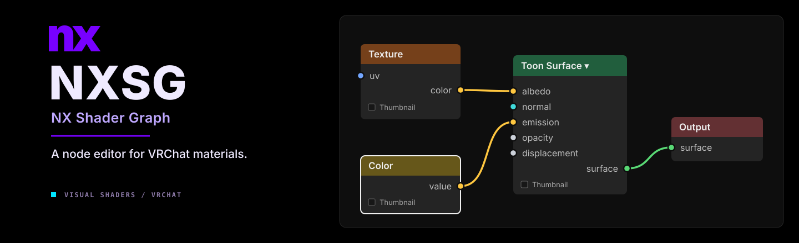
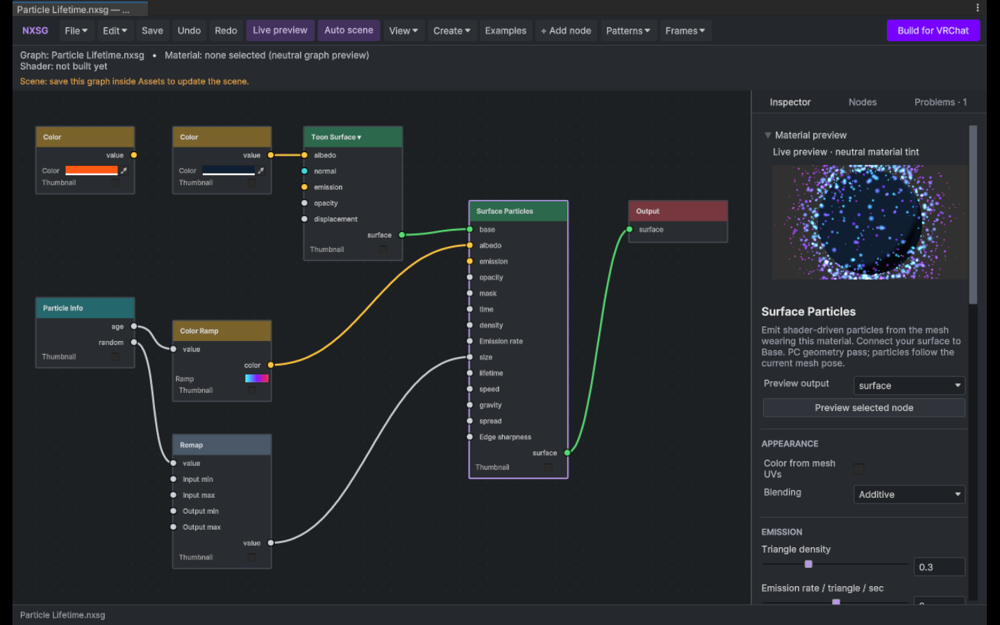
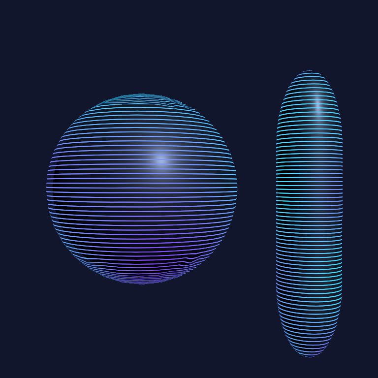
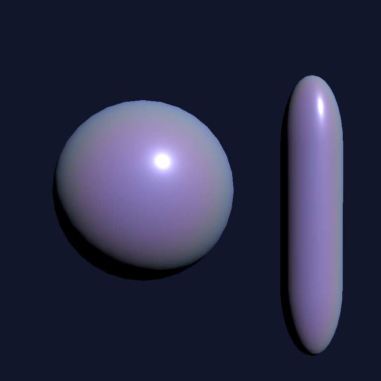
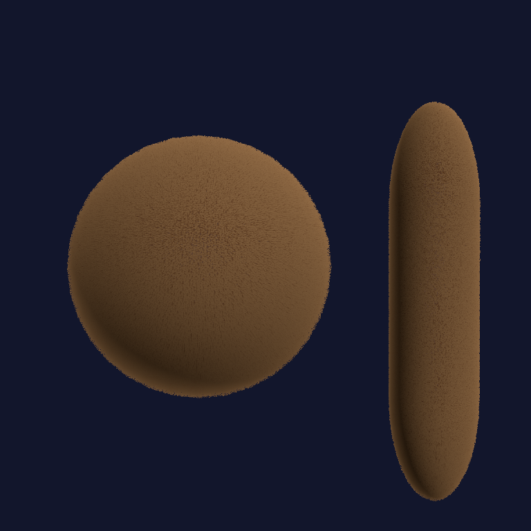
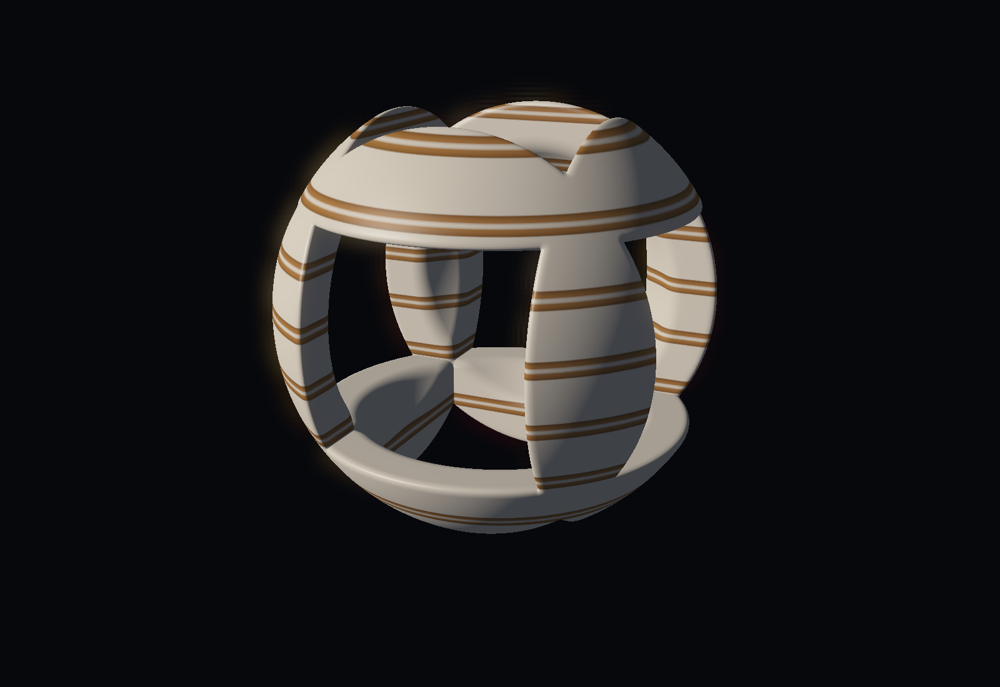

<p align="center">
  
</p>

<p align="center">
  <code>Early alpha</code> &nbsp; <code>Unity 2022.3.22f1</code> &nbsp; <code>Built-In</code> &nbsp; <code>PC VRChat</code>
</p>

NXSG is a shader graph editor for Unity's Built-In Render Pipeline, developed for PC VRChat avatars. It includes Toon, PBR and Unlit shading, procedural textures, fur, particles, and animated effects. Materials are built by connecting nodes, with controls for lighting, color, masks, and movement.

The editor generates shaders and materials directly in Unity. Graphs remain editable as `.nxsg` files, and included examples provide starting points for common effects.

<h2 align="center"><a href="https://nerdrx.github.io/nxsg/#install">Install NXSG</a></h2>
<p align="center">
  ALCOM / Creator Companion<br /><br />
  <a href="https://github.com/nerdrx/nxsg/releases">Download releases</a> &nbsp;·&nbsp;
  <a href="docs/VPM.md">Installation help</a>
</p>

Add the NXSG repository, enable **Show Pre-Release Packages**, and install **NX Shader Graph** in your project. NXSG is currently in early alpha; use a test project for your first installation.

<details>
<summary>VPM repository URL</summary>

```text
https://nerdrx.github.io/nxsg/index.json
```

</details>

<p align="center">
  <a href="docs/QUICK_START.md"><strong>Getting started</strong></a> &nbsp;·&nbsp;
  <a href="docs/NODES.md"><strong>Documentation</strong></a> &nbsp;·&nbsp;
  <a href="Packages/dev.nerdrx.nxsg/Samples~/README.md"><strong>Example graphs</strong></a>
</p>

---

## Features

| Feature | Includes |
| :--- | :--- |
| **Surface shading** | Toon, PBR and Unlit surfaces, normal maps, matcaps, rim lighting, and configurable lighting brightness and saturation. |
| **Material effects** | Glitter, emission, iridescence, holograms, dissolve, stickers, and wireframes. |
| **Fur** | Shell fur, silhouette fins, and cards generated from mesh edges, with root/tip coloring, masks, grooming, wind, local self-shadowing, and shell distance LOD. |
| **Procedural textures** | 1D–4D noise, Voronoi, Musgrave-style fractals, checkerboards, waves, ramps, distortion, and texture bombing. |
| **Texture coordinates** | Mesh UVs, object/world projection, Polar and Panosphere coordinates, scrolling, rotation, and other UV transforms. |
| **Geometry effects** | Nested shells, parallax, parallax occlusion, tessellation, and shader-driven particles emitted from the mesh. |
| **Animation** | Flipbooks, vertex animation, AudioLink inputs, and animatable material properties. |
| **Volumes** | Raymarched distance fields and procedural volume rendering. |
| **Lighting integrations** | Additional pixel lights for Toon/PBR base surfaces and optional LTCGI support. |

See the [node guide](docs/NODES.md) for individual nodes, inputs, and settings.

## Graph editor

[](docs/UI_POLISH.md)

The editor supports searching for nodes, connecting from either socket direction, and adding compatible nodes by dropping a wire on empty space. Related operations can be switched directly from node headers.

Other editor features include:

- Box selection, copy/paste, duplication, and reusable node groups called **Patterns**.
- Named texture slots shared between the graph and material inspector.
- Intermediate output previews, A/B material snapshots, and animation scrubbing.
- Texture-set import, presets, and static texture baking.
- Automatic scene updates for saved edits, build diagnostics, and recovery snapshots.

### Basic workflow

1. Open **Tools → NXSG → Open Graph Editor**.
2. Save your graph inside **Assets**, then select **Build for VRChat**.
3. Assign the generated material from **Assets/NXSGGenerated** to your mesh.

This builds local assets; avatar uploading still uses the VRChat SDK.

[Editor controls](docs/QUICK_START.md) · [Creator workflow](docs/CREATOR_WORKFLOW.md) · [Build performance](docs/BUILD_PERFORMANCE.md)

## Example materials

<table>
  <tr>
    <td width="33%" align="center" valign="top"><a href="Packages/dev.nerdrx.nxsg/Samples~/README.md"></a><br /><strong>Layered holograms</strong><br /><sub>Emission and scanlines on offset shell layers.</sub></td>
    <td width="33%" align="center" valign="top"><a href="Packages/dev.nerdrx.nxsg/Samples~/README.md"></a><br /><strong>Pearl and iridescence</strong><br /><sub>View-dependent color and reflections.</sub></td>
    <td width="33%" align="center" valign="top"><a href="docs/FUR_AND_PARALLAX.md"></a><br /><strong>Soft, short fur</strong><br /><sub>Shell fur with root and tip coloring.</sub></td>
  </tr>
</table>

These are Unity renders from included graphs. The fur study uses **24 shells**; it's an appearance study, not a performance target. [Watch the hologram move](https://nerdrx.github.io/nxsg/#material-studies).

### Raymarched volumes

[](docs/VOLUMES.md)

This sculpture is drawn inside a cube using distance fields. The same volume tools can make drifting dust and smoke. [Explore the three volume studies](docs/VOLUMES.md)—the graphs are included. Use a closed cube proxy. These Unity renders use presentation bloom and tone mapping; raymarching is an experimental PC effect with a per-pixel cost.

## Compatibility

NXSG currently targets **Unity 2022.3.22f1** and the **Built-In Render Pipeline** for **PC VRChat**. Development and editor testing take place on Linux. Native Windows/D3D, headset, and live VRChat validation remain incomplete. Quest/mobile avatars are not supported.

The project is in early alpha. AudioLink and animatable properties are implemented, but live AudioLink and VRCFury integration checks are still pending. Keyboard undo can be unreliable in the Linux Unity editor; toolbar undo/redo is available.

[Compatibility details](docs/COMPATIBILITY.md) · [Validation results](docs/VALIDATION.md)

<details>
<summary><strong>Effect limitations and performance</strong></summary>

- **Geometry and performance.** Fur, shells, particles and tessellation can be expensive. Generated cards follow triangle edges and can overlap. Cost warnings are estimates, not GPU measurements.
- **Lighting.** Additional pixel lights affect Toon/PBR base surfaces; fur and shell overlays have more limited lighting. Brightness limits apply per contribution, not to the sum of all lights.
- **Rendering approximations.** Refraction samples the screen. Fur self-shadowing estimates a local volume. Transparent layers can sort incorrectly, and displaced effects may need larger renderer bounds.
- **Integration testing.** AudioLink and animatable properties exist; live AudioLink and VRCFury checks remain pending. Motion inputs read avatar speed, not individual bones or PhysBones. Patterns are editable copies, not linked instances.

[Compatibility](docs/COMPATIBILITY.md) · [Validation](docs/VALIDATION.md)

</details>

## Bugs and feedback

Report bugs and request features through [GitHub Issues](https://github.com/nerdrx/nxsg/issues). Please include your NXSG version, Unity version, a screenshot, and a small example graph where possible. Check existing issues before submitting a new report.

Current development priorities include avatar and stereo testing, fur performance, and editor usability. The node SDK, Blender bridge, CLI, and web viewer are planned work, not current features.

<details>
<summary><strong>For contributors</strong></summary>

The graph model, compiler and Unity editor are separate. `.nxsg` stores the editable graph; ShaderLab/HLSL is generated from it. Unity asset references live in an adapter section.

With Git, Python 3 and Unity Hub installed:

```bash
git clone https://github.com/nerdrx/nxsg.git
cd nxsg
python3 scripts/setup-vrchat-fixture.py
```

The setup script downloads and verifies pinned VRChat Base/Avatars **3.10.5** packages. Open **DevProject** in Unity **2022.3.22f1** afterward.

[Development setup](docs/DEVELOPMENT.md) · [Design document](NXSG_DESIGN.md) · [Implementation plan](docs/IMPLEMENTATION_PLAN.md)

</details>

---

### Credits and source

Graphlit, ShaderGraphVRC and Poiyomi informed the research. Panosphere seam handling follows Poiyomi's derivative-aware approach, credited under its MIT license in the [third-party notices](Packages/dev.nerdrx.nxsg/Third%20Party%20Notices.md). [Research notes](docs/research/EDITOR_UX_AND_PRIOR_ART.md) · [Artwork credits](docs/assets/README.md).

NXSG's source is public. **No project-wide open-source license has been selected yet.** Third-party components retain their own licenses.
