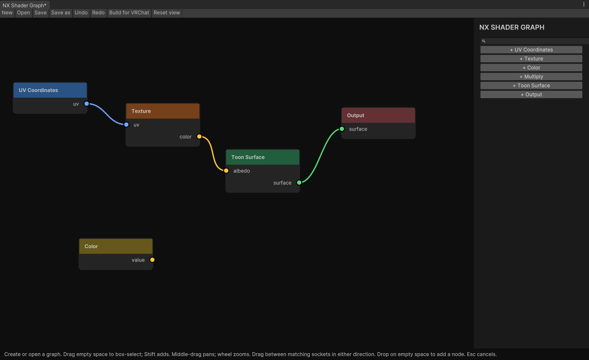

<p align="center">
  
</p>

<p align="center">
  <strong>Build your own VRChat materials. Right inside Unity.</strong><br />
  Connect textures, shape masks, add movement—and see what you’re making.
</p>

<p align="center">
  <a href="https://nerdrx.github.io/nxsg/#install"><strong>Install NXSG</strong></a> ·
  <a href="docs/QUICK_START.md">First material</a> ·
  <a href="docs/NODES.md">Node guide</a> ·
  <a href="Packages/dev.nerdrx.nxsg/Samples~/README.md">Examples</a> ·
  <a href="https://github.com/nerdrx/nxsg/releases">Releases</a>
</p>

## From a texture to something that's yours

NXSG is a shader graph for VRChat avatar creators. Start with a texture and a surface, then build up the look: soft fur, a scrolling pattern, a glitter mask, a hologram floating above the mesh. You can keep it simple or keep connecting things.

The editor takes cues from Blender: colored sockets, wires you can drag from either end, searchable nodes and previews while you work. **Build for VRChat** generates the shader and material locally. **Auto scene** applies saved edits after a short pause.

**Early alpha · Unity 2022.3.22f1 · PC Built-In.** Developed and tested on Linux. Native Windows/D3D, headsets and the live VRChat client still need validation; Quest/mobile avatars aren't supported. Start in a test project. [What has been tested](docs/VALIDATION.md).

<table>
  <tr>
    <td align="center" width="33%"><br /><strong>Layered hologram</strong></td>
    <td align="center" width="33%"><br /><strong>Pearl finish</strong></td>
    <td align="center" width="33%"><br /><strong>Short plush fur</strong></td>
  </tr>
</table>

Real Unity renders from the included example graphs. The fur study uses **24 shells**—it's a look to experiment with, not a performance recommendation. [Watch the hologram move](https://nerdrx.github.io/nxsg/#material-studies).

## Shapes made in the shader

A hollow pearl-and-gold sculpture, violet dust, and a burning ring—built with Volume Surface, procedural noise and distance fields.

[](https://nerdrx.github.io/nxsg/#raymarching)

[See all three studies and get the graphs](docs/VOLUMES.md). These are Unity renders with presentation bloom and tone mapping. Raymarching nodes ship in alpha.26; these newer study graphs are available in source, not in alpha.26. Use a closed cube proxy. This is an experimental PC effect with a per-pixel cost.

## Made for experimenting

| Make | Start with |
| :--- | :--- |
| **Your everyday material** | Toon, PBR or Unlit; textures, normal maps, matcaps, rims and named texture slots. Lit surfaces have minimum/maximum brightness and lighting saturation. Albedo alpha is optional. |
| **Fur with some character** | Shell fur, silhouette fins or **cards-only fur** generated from mesh edges. Root/tip colors, masks, grooming, wind and local self-shadowing. Shells have distance LOD. |
| **Something that catches the light** | View-dependent glitter, iridescence, additional pixel lights and optional LTCGI. |
| **Layers over the mesh** | Nested shells, holograms, stickers, wireframes, parallax, parallax occlusion and tessellation. |
| **Patterns you can reshape** | 1D–4D noise, Voronoi, Musgrave-style fractals, waves, ramps, distortion, texture bombing, Polar and Panosphere coordinates. |
| **A material that moves** | UV scrolling, flipbooks, dissolve, vertex animation, AudioLink inputs and shader-driven particles emitted from the mesh. |

The [node guide](docs/NODES.md) covers the nodes, their inputs and their controls. A **Fur Cards** example is included alongside the other sample graphs.

### A graph you can work in



- Drop a wire on empty space to add a compatible node. Pull from a connected input to detach it.
- Switch related operations from the node header. Rename texture slots so the graph and material inspector agree.
- Box-select, copy, paste, duplicate and reuse groups as **Patterns**.
- Preview intermediate values, compare A/B material snapshots and scrub animation time.
- Use texture-set import, presets and static texture baking to cut down on repetitive work.

There are also mesh-preview handles for sticker placement and an FX Animator driver for locomotion-aware effects. Motion nodes read avatar speed—not individual bones or PhysBones. [Creator workflow](docs/CREATOR_WORKFLOW.md) · [Motion and handles](docs/MOTION_AND_HANDLES.md).

## Get it into Unity

1. [Open the installer page](https://nerdrx.github.io/nxsg/#install) and add the repository to **ALCOM or Creator Companion**.
2. Enable **Show Pre-Release Packages**, then add **NX Shader Graph** to your project.
3. In Unity, open **Tools → NXSG → Open Graph Editor**.
4. Create a graph, or import **Example Graphs** from NXSG's Unity Package Manager entry.
5. Save inside **Assets**, click **Build for VRChat**, then assign the material from **Assets/NXSGGenerated** to your mesh.

Manual repository URL:

```text
https://nerdrx.github.io/nxsg/index.json
```

Build creates local assets; it does not upload your avatar. [First material walkthrough](docs/QUICK_START.md) · [Install troubleshooting](docs/VPM.md).

<details>
<summary><strong>Canvas controls and recovery</strong></summary>

| Action | Control |
| :--- | :--- |
| Connect | Drag between sockets, or click both endpoints |
| Detach | Pull from the connected input |
| Select a group | Drag empty canvas; Shift adds to selection |
| Pan / zoom | Middle-drag / scroll wheel |
| Find a node | Space on the canvas |
| Fit graph / frame selection | Home / F |
| Copy / paste / duplicate | Toolbar or Ctrl+C / Ctrl+V / Ctrl+D |
| Undo / redo | Toolbar buttons; keyboard undo remains unreliable on Linux/Unity |

Failed builds keep the last working shader. Recovery snapshots are stored under `Library/NXSG/Recovery`; deleting Library removes those snapshots too.

</details>

## Know the rough edges

NXSG is moving quickly, and there are bugs to find. A few limits matter before you build a whole avatar around it:

- **Geometry costs add up.** Fur, shells, particles and tessellation can be expensive. Cards follow triangle edges, which can overlap. Cost warnings are estimates, not GPU measurements.
- **Lighting isn't identical across every effect.** Additional pixel lights affect Toon/PBR base surfaces; fur and shell overlays have more limited lighting. Brightness limits apply per contribution, not to the sum of all lights.
- **Some effects are approximations.** Refraction samples the screen, fur self-shadowing estimates a local volume, and transparent layers can have sorting issues. Renderer bounds may need expansion.
- **Integration testing is unfinished.** AudioLink inputs and animatable properties exist; live AudioLink and VRCFury checks are still pending. Patterns are editable copies, not linked graph instances.

[Fur and parallax](docs/FUR_AND_PARALLAX.md) · [Glitter](docs/GLITTER.md) · [Particles](docs/PARTICLES.md) · [Tessellation](docs/TESSELLATION.md) · [LTCGI](docs/LTCGI.md) · [Compatibility](docs/COMPATIBILITY.md)

## Help shape it

If something breaks—or a control makes no sense—[open an issue](https://github.com/nerdrx/nxsg/issues). A small `.nxsg` graph, your Unity version and a screenshot make it much easier to reproduce.

Next: more testing on actual avatars and in stereo, better fur performance, and fewer awkward controls. A community node SDK, Blender bridge, CLI and web viewer are longer-term plans.

<details>
<summary><strong>For contributors</strong></summary>

The graph model, compiler and Unity editor are separate. `.nxsg` stores the editable graph; ShaderLab/HLSL is generated from it. Unity asset references live in an adapter section.

With Git, Python 3 and Unity Hub installed:

```bash
git clone https://github.com/nerdrx/nxsg.git
cd nxsg
python3 scripts/setup-vrchat-fixture.py
```

The setup script downloads and verifies pinned VRChat Base/Avatars **3.10.5** packages. Open **DevProject** in Unity **2022.3.22f1** afterward.

[Development setup](docs/DEVELOPMENT.md) · [Design document](NXSG_DESIGN.md) · [Implementation plan](docs/IMPLEMENTATION_PLAN.md)

</details>

### Credits and source

Graphlit, ShaderGraphVRC and Poiyomi informed the research. Panosphere seam handling follows Poiyomi's derivative-aware approach, credited under its MIT license in the [third-party notices](Packages/dev.nerdrx.nxsg/Third%20Party%20Notices.md). [Research notes](docs/research/EDITOR_UX_AND_PRIOR_ART.md) · [Artwork credits](docs/assets/README.md).

NXSG's source is public. **No project-wide open-source license has been selected yet.** Third-party components retain their own licenses.
