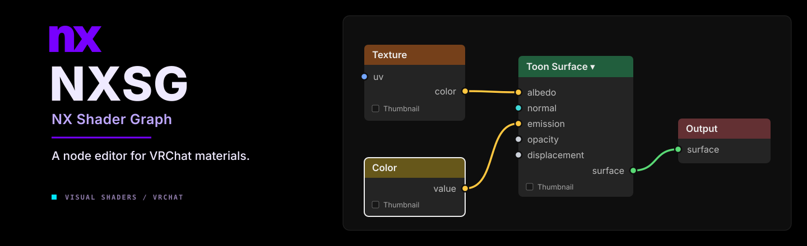
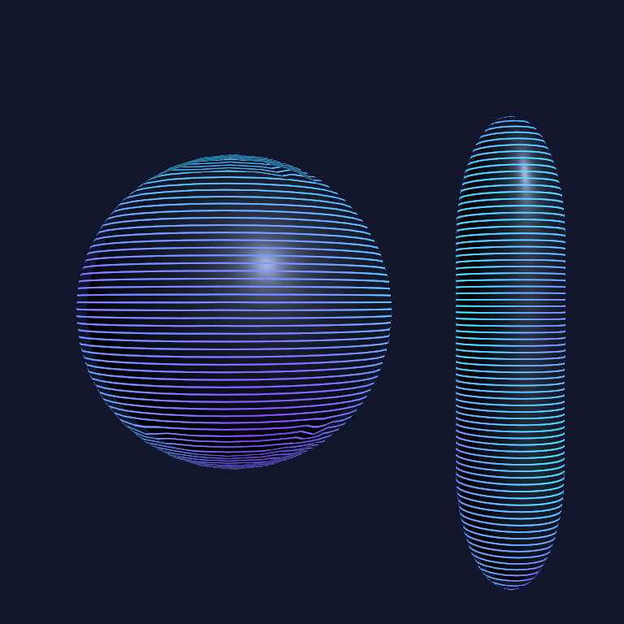
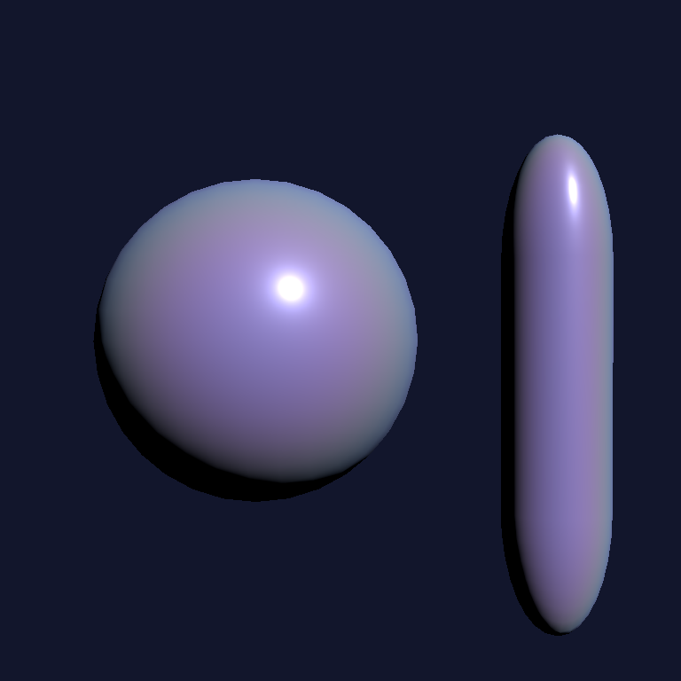
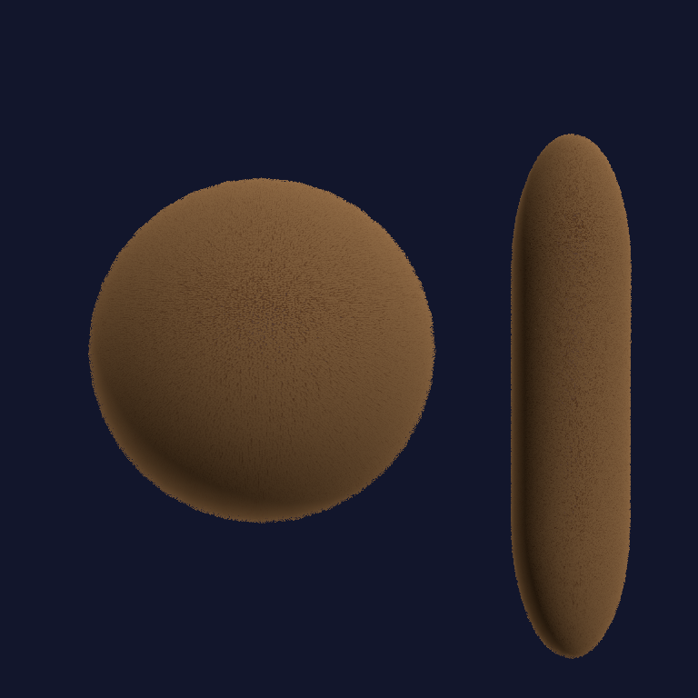
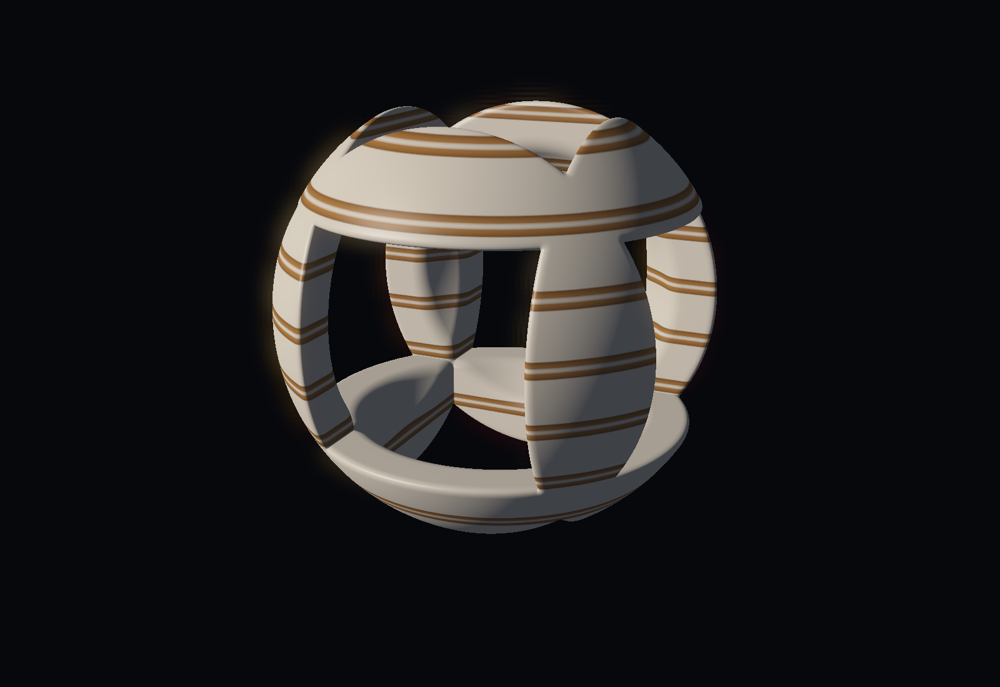

<p align="center">
  
</p>

<p align="center">
  <code>v2.4.9</code> &nbsp; <code>Unity 2022.3.22f1</code> &nbsp; <code>Built-In</code> &nbsp; <code>PC VRChat + mobile bake</code>
</p>

<p align="center"><strong>Build materials by connecting nodes in Unity.</strong><br />Toon, PBR, fur, particles, procedural textures, animation, and lighting for PC VRChat avatars.</p>

<p align="center">
  <a href="https://nerdrx.github.io/nxsg/#install"><strong>Install</strong></a> &nbsp;·&nbsp;
  <a href="docs/QUICK_START.md">First material</a> &nbsp;·&nbsp;
  <a href="docs/NODES.md">Node guide</a> &nbsp;·&nbsp;
  <a href="https://github.com/nerdrx/nxsg/releases/tag/v2.4.9">Latest release</a>
</p>

---

## Make your first material

1. Add the [NXSG VPM repository](https://nerdrx.github.io/nxsg/#install) to ALCOM or Creator Companion and install **NX Shader Graph**.
2. In Unity, open **Tools → NXSG → Open Graph Editor**. Import an [example graph](Packages/dev.nerdrx.nxsg/Samples~/README.md) or create one.
3. Save the `.nxsg` file inside **Assets**, select **Build for VRChat**, and assign the generated material from **Assets/NXSGGenerated**.

The graph stays editable. Building creates local Unity assets; uploading your avatar remains a VRChat SDK step. [Full installation guide](docs/VPM.md) · [First material walkthrough](docs/QUICK_START.md)

<details><summary>Manual VPM repository URL</summary>

```text
https://nerdrx.github.io/nxsg/index.json
```

</details>

<a href="docs/CREATOR_WORKFLOW.md"></a>

*An actual Unity editor capture: the graph, labelled branches, and material preview.*

## What you can build

| | In the graph |
| :--- | :--- |
| **Surfaces and light** | Toon, PBR, and Unlit materials; layered shadows, rims, matcaps, normal maps, face shadows, clearcoat, and brightness controls. |
| **Texture and color** | Named texture slots, UV transforms, Panosphere, procedural noise and patterns, color grading, masks, and ramps. |
| **Fur and geometry** | Shell fur, silhouette fins, mesh-edge cards, outlines, parallax, displacement, tessellation, and mesh-emitted particles. |
| **Effects and motion** | Glitter, holograms, emission, iridescence, dissolve, decals, flipbooks, AudioLink inputs, and animatable properties. |
| **Advanced effects** | Raymarched volumes, screen-space depth effects, SDF text, optional LTCGI and VRC Light Volumes. |

Only the connected graph branches contribute to a generated shader. Use the [node guide](docs/NODES.md) for every input, the [rendering guide](docs/RENDERING_FEATURES.md) for setup, and [example graphs](Packages/dev.nerdrx.nxsg/Samples~/README.md) to see complete materials. Expensive effects are optional; the **Cost** panel estimates passes and costly operations, not GPU frame time.

## Graph editor

Search for a node or drop a wire into empty space to add a compatible one. Preview intermediate outputs, then build a shader containing the branches your material uses.

- **Keep large graphs readable.** [Auto-organize](docs/CREATOR_WORKFLOW.md#organizing-the-canvas) groups connected branches into labelled frames; selection layout and grid snapping are available too. Organization is one Undo step and leaves connections unchanged.
- **Work in context.** Named texture slots appear in both graph and material inspector. Changed settings carry `*` markers; advanced inputs and inspector sections fold away without hiding connected sockets.
- **Iterate safely.** Use live previews, time scrubbing, A/B material snapshots, Undo/Redo, and recovery snapshots.
- **Bring existing work.** Import texture sets or use assisted Poiyomi/lilToon material translation with a backup. Review the generated graph and material after conversion.
- **Watch cost.** The **Cost** panel estimates passes and highlights expensive nodes. It does not measure GPU time.

[Editor controls](docs/QUICK_START.md) · [Creator workflow](docs/CREATOR_WORKFLOW.md) · [Material recipes](docs/RECIPES.md) · [Build performance](docs/BUILD_PERFORMANCE.md)

## Mobile material snapshots

**Bake for Mobile** captures a selected desktop material at one moment and creates a separate `VRChat/Mobile/Toon Standard` material. NXSG bakes connected albedo, emission, normal, metallic, roughness, and occlusion branches. It swaps matching material slots in open scenes when you switch Unity's build target to Android, and restores desktop materials when you switch back.

This is a snapshot, not full shader parity: mobile output is opaque, particles and displaced geometry are omitted, and view-dependent effects are sampled from one preview angle. Rebake after edits and inspect the Android avatar before upload. [How mobile baking works](docs/MOBILE_BAKING.md) · [Latest bake fix](docs/RELEASE_2_4_5.md)

## Example materials

[](docs/RENDERING_FEATURES.md)

Toon bands and texture ramps, an inverted-hull outline, and camera-depth lighting. The right-hand comparison shows the same scene with depth effects off and on. [Rendering controls and setup](docs/RENDERING_FEATURES.md).

<table>
  <tr>
    <td width="33%" align="center" valign="top"><a href="Packages/dev.nerdrx.nxsg/Samples~/README.md"></a><br /><strong>Layered holograms</strong><br /><sub>Emission and scanlines on offset shell layers.</sub></td>
    <td width="33%" align="center" valign="top"><a href="Packages/dev.nerdrx.nxsg/Samples~/README.md"></a><br /><strong>Pearl and iridescence</strong><br /><sub>View-dependent color and reflections.</sub></td>
    <td width="33%" align="center" valign="top"><a href="docs/FUR_AND_PARALLAX.md"></a><br /><strong>Soft, short fur</strong><br /><sub>Shell fur with root and tip coloring.</sub></td>
  </tr>
</table>

These are Unity renders from included graphs. The fur study uses **24 shells**; it's an appearance study, not a performance target. [Watch the hologram move](https://nerdrx.github.io/nxsg/#material-studies).

### Raymarched volumes

[](docs/VOLUMES.md)

This sculpture is drawn inside a cube using distance fields. The same volume tools can make drifting dust and smoke. [Explore the three volume studies](docs/VOLUMES.md)—the graphs are included. Use a closed cube proxy. These Unity renders use presentation bloom and tone mapping; raymarching is an experimental PC effect with a per-pixel cost.

## Compatibility

NXSG generates **PC Built-In** shaders for **Unity 2022.3.22f1**. Mobile avatars use the separate baked Toon Standard material described above; the PC shader itself does not run on Quest. Development and editor tests run on Linux. The creator has reported VR and mirror use, while a reproducible native Windows/client/headset test matrix remains open.

AudioLink and animatable properties are implemented, but live AudioLink and VRCFury integration checks are still pending. Keyboard undo can be unreliable in the Linux Unity editor; toolbar undo/redo is available.

[Compatibility details](docs/COMPATIBILITY.md) · [Validation results](docs/VALIDATION.md)

<details>
<summary><strong>Effect limitations and performance</strong></summary>

- **Geometry and performance.** Fur, shells, particles and tessellation can be expensive. Generated cards follow triangle edges and can overlap. Cost warnings are estimates, not GPU measurements.
- **Lighting.** Additional pixel lights affect Toon/PBR base surfaces; fur and shell overlays have more limited lighting. Brightness limits apply per contribution, not to the sum of all lights.
- **Rendering approximations.** Refraction samples the screen. Fur self-shadowing estimates a local volume. Transparent layers can sort incorrectly, and displaced effects may need larger renderer bounds.
- **Integration testing.** AudioLink and animatable properties exist; live AudioLink and VRCFury checks remain pending. Motion inputs read avatar speed, not individual bones or PhysBones. Patterns are editable copies, not linked instances.

[Compatibility](docs/COMPATIBILITY.md) · [Validation](docs/VALIDATION.md)

</details>

## Bugs and feedback

Report bugs and request features through [GitHub Issues](https://github.com/nerdrx/nxsg/issues). Please include your NXSG version, Unity version, a screenshot, and a small example graph where possible. Check existing issues before submitting a new report.

Current development priorities include avatar and stereo testing, fur performance, and editor usability. The node SDK, Blender bridge, CLI, and web viewer are planned work, not current features.

## Research archive

[Read the NXSG 1.5 report (PDF, 39 pages)](docs/reports/nxsg-1.5-state-research-validation.pdf)

A dated snapshot of version 1.5: capabilities at that release, possible future directions, test evidence, research decisions, and its node and example catalogs, with 22 charts and diagrams. For current behavior, use the guides above. [Report date and scope](docs/reports/README.md).

<details>
<summary><strong>For contributors</strong></summary>

The graph model, compiler and Unity editor are separate. `.nxsg` stores the editable graph; ShaderLab/HLSL is generated from it. Unity asset references live in an adapter section.

With Git, Python 3 and Unity Hub installed:

```bash
git clone https://github.com/nerdrx/nxsg.git
cd nxsg
python3 scripts/setup-vrchat-fixture.py
```

The setup script downloads and verifies pinned VRChat Base/Avatars **3.10.5** packages. Open **DevProject** in Unity **2022.3.22f1** afterward.

[Development setup](docs/DEVELOPMENT.md) · [Design document](NXSG_DESIGN.md) · [Implementation plan](docs/IMPLEMENTATION_PLAN.md)

</details>

---

### Credits and source

Graphlit, ShaderGraphVRC and Poiyomi informed the research. Panosphere seam handling follows Poiyomi's derivative-aware approach, credited under its MIT license in the [third-party notices](Packages/dev.nerdrx.nxsg/Third%20Party%20Notices.md). [Research notes](docs/research/EDITOR_UX_AND_PRIOR_ART.md) · [Artwork credits](docs/assets/README.md).

NXSG's source is public. **No project-wide open-source license has been selected yet.** Third-party components retain their own licenses.
