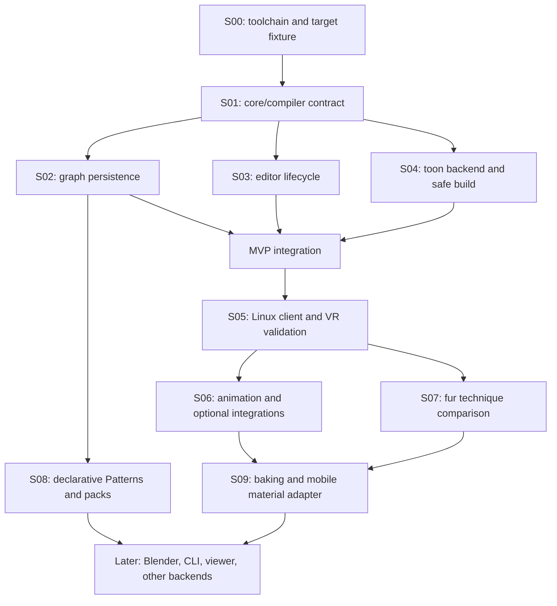

# Implementation plan and acceptance gates

This plan turns the research into bounded work. A first Linux implementation slice is running; [recorded checks](VALIDATION.md) cover core, rendering and build recovery. Full milestone acceptance below is still **pending**. Research is complete enough to begin the specified spikes; it does not establish that the proposed editor or shaders work.

Read [decisions](DECISIONS.md), [risk register](RISK_REGISTER.md), and the [source snapshot](research/COMPATIBILITY_SNAPSHOT.json) first. A size of S/M/L indicates relative scope, not a time promise. Pin versions in a fresh fixture before implementation and record changes to the research baseline.

**Linux is the primary development and test environment.** No Windows machine is required to begin or finish Linux milestones. The PC VRChat shader target is distinct from the authoring OS; a future native Windows smoke test qualifies Windows support rather than blocking Linux work.

## Work order

The standalone parser can progress while a licensed Unity fixture is being arranged. This does not close its Unity compatibility gate. Start at most three independent implementation lanes once S01 fixes their shared contract: graph persistence, editor interaction, and shader backend. Each lane owns separate directories and fixtures. Integrate a small working material before expanding the node library.

## S00 — Confirm environments and dependency pins · S · owner: integration

Create a clean **Linux Unity 2022.3.22f1** avatar fixture with VRChat Base/Avatars **3.10.5**, retaining project/package lock files and asset metadata. Use a Linux-capable package workflow, such as a verified VPM CLI or community vrc-get setup; the Windows VCC GUI is not required. Verify downloaded archives against the listing checksums. Record OS, editor modules, graphics API, and license availability. Confirm a standalone .NET SDK is available for portable tests; the local `dotnet` command currently reports runtimes but no SDK.

**Pass:** the Linux fixture opens, SDK validation is available, a baseline material renders, and the same tiny core assembly loads in Linux Unity and a standalone runner. Record the working Editor API and establish the available Linux VRChat/headset route for S05. Use headless Gamescope where appropriate for unobtrusive graphics-enabled editor checks; `-nographics` is only for checks that do not render. Do not label an offscreen editor check headset validation.

**Evidence:** exact versions, manifest/lock, startup/compilation logs, baseline image, environment record. The Editor was subsequently located on a mounted drive and exercised with the installed Hub licensing helper; see the validation record. Client/headset acceptance remains open.

## S01 — Freeze the smallest cross-lane contract · S · owner: core

Specify the first `.nxsg` fixture and typed socket table. Include stable graph/node/socket/parameter IDs, literal vs mutable binding, explicit color/data interpretation, UV coordinates, target hints, and resource resolution errors. Fix the handoff types between parsing, validation, emission, editor commands, and diagnostics. Decide numeric serialization and basic JSON parser limits.

**Pass:** a written example represents `Texture → Toon → Output`; editor layout does not change the semantic hash; an exposed property cannot be mistaken for a constant; texture import/color settings are explicit. Keep extension hooks as data fields only until a concrete second use needs an abstraction.

**Evidence:** schema/fixture, a concise port conversion table, and examples of a type error, missing resource, and cycle diagnostic.

## S02 — Persistence, migrations, and graph safety · M · owner: core

Implement parse/validate/save and minimal DCE/constant folding. Use invariant serialization, bounded graph/Pattern expansion, known operation IDs, and inert unknown-node preservation. Keep resource lookup outside the parser. Define exported properties separately from execution liveness. Avoid arbitrary polymorphic deserialization.

**Pass:** roundtrip, duplicate/paste, undo snapshot, key ordering, different locale, malformed JSON, nonfinite values, direct/group cycles, missing/unknown nodes, schema upgrade, and newer schema rejection behave predictably. Unused pure expressions vanish; mutable properties remain mutable; source is recoverable after failed migration. Set explicit byte/node/depth caps based on fixtures, with user-facing errors rather than stack exhaustion.

**Evidence:** focused portable tests with independently expected outputs and a documented fixture. No GPU performance claim comes from these tests.

## S03 — Custom canvas comparison, lifecycle, and discovery · M · owner: editor

Compare two small adapters on **Unity 2022.3.22f1**: a custom UI Toolkit canvas and Experimental.GraphView. Share the same S01 graph commands and fixture. Evaluate pan/zoom, node movement and selection, port connections, edge hit testing, keyboard use and implementation size before choosing. GraphView is optional; newer Unity graph packages are outside the baseline. See the [version-specific canvas research](research/CUSTOM_CANVAS_ON_UNITY_2022.md).

Then implement add/search/connect, undo/redo, save/reopen, an inspector, and one material preview on the selected adapter. Expose a visible Add action, typed labels, and clear invalid-connection explanations. Keep the input graph separate from preview cache state.

**Pass:** grouped edits survive undo/redo and domain reload; external edits do not silently overwrite unsaved work; search responds for defined intent queries; hidden previews pause; resources are disposed on close. Exercise a 20-node and a 200-node fixture. The editor remains usable during compilation and labels a stale preview.

**Evidence:** a short side-by-side decision record, interaction recording/screenshots, lifecycle logs, measured response times and memory trend. Include code owned and accessibility gaps. If an adapter blocks a required workflow, change only that adapter.

## S04 — Minimal toon backend and safe output · M · owner: rendering

Emit an opaque Built-In forward shader with texture/tint, defined toon diffuse and ambient behavior, main shadow receiving, a matching shadow caster, stable properties, stereo setup, and documented VRChat fallback. Treat additional lights, alpha clipping, outlines, fur, and advanced lighting as explicit follow-ons. Implement a local Build action that stages shader output, verifies import/compile, preserves output identities and material values, and reports node-linked errors.

**Pass:** a baseline mesh renders with expected main light/ambient/shadows; emitted pass/keyword count matches intent; required target variants are explicitly compiled and checked, not merely imported; a broken node maps to its source; a failed build retains the last good output. Rebuild, rename, duplicate, and move the source graph without misbinding materials. Layout changes should not trigger shader regeneration. For multi-file publication, inject failure between writes and show recovery rather than assuming filesystem rename makes a whole build atomic.

**Evidence:** generated shader fixture, Unity compilation logs, Frame Debugger capture, property/material before-after checks, and recovery results.

## MVP integration gate

An avatar creator must complete this path without editing HLSL: create graph, add texture, adjust tint/toon response, see a material preview, save/reopen, build, assign to a mesh, rebuild while retaining material settings, and understand one intentional error. Graph reload, stable asset references, and diagnostics are part of the MVP. A large node catalogue is not required to pass it.

## S05 — Linux rendering and PC VRChat acceptance · M · owner: validation

Run graphics-enabled tests in the pinned Linux Unity/SDK fixture, then establish VRChat Build & Test or the supported local test handoff with a representative avatar on the available Linux client setup. If VRChat runs through Proton, record Proton, DXVK/graphics translation where applicable, graphics API, client and VR runtime versions; do not assume that route is already installed or validated. Exercise actual target-variant compilation where the installed toolchain supports it, and report untested variants explicitly.

Cover both eyes, desktop view, mirrors, camera modes, blocked-shader fallback, shadows, object scale/rotation, and intended stereo paths. A synthetic Unity XR fixture can test additional stereo modes, but must not be presented as a selectable VRChat client setting. Native Windows testing is an optional later portability check and becomes necessary only for an explicit verified-Windows support claim.

**Pass:** matched captures show no eye mismatch or unintended lighting/fallback change; the SDK accepts the avatar; the graph and material behave in the actual client. Record headroom, GPU time where available, and missed-frame behavior under declared conditions. Do not use an FPS number from a compositor alone as material GPU timing.

**Evidence:** per-environment images/logs with settings and hardware, validation results, baseline timings. Publishing an avatar is not required by this gate; Build & Test comes first.

## S06 — Animation and optional integrations · M · owner: integration

Add UV scroll, sampled animated noise, emission modulation, gradient/hue, then flipbook/dissolve. Test float/color/vector animation through ordinary clips and VRCFury's public Material Property workflow. Add an optional AudioLink adapter with explicit missing-package and missing-runtime-data behavior. Later procedural/evolving noise must document its algorithm and seamless-loop conditions.

**Pass:** optimized and unoptimized outputs agree over time; renamed display labels preserve property bindings; multiple material slots expose renderer-wide effects clearly; AudioLink installed/absent/runtime-missing cases behave as specified. A neutral input must not freeze a runtime property at compile time. Dissolve color and shadow masks agree. No shader assumes arbitrary user avatar scripts or synchronized client time.

**Evidence:** animation clips, property binding manifest, full-loop captures, dependency versions, and AudioLink active/absent comparisons.

## S07 — Fur as an experiment before a default · L · owner: rendering

Compare shell generation techniques on the same rigged mesh, with preserved blendshapes, tangent basis, masks, length/direction, and bounded displacement. Vary shell count, shadows, mirror view, and LOD. Prototype fins/hybrid only if shell silhouettes justify another technique. Include synthetic wind/noise motion with an explicit source, a simplified shadow, and a low-cost PC fallback.

**Pass:** the chosen technique improves the desired silhouette within a measured budget; skinned poses, negative/nonuniform scale, UV seams, bounds, two-eye views, and LOD transitions remain acceptable. Report remaining pass/geometry costs when shells are clipped. Do not ship “automatic LOD savings” based only on a shader branch.

**Evidence:** paired images, source mesh/rig fixture, settings, frame-time distributions and pass/geometry counts. Preserve a plain toon control and publish failed experiments as concise conclusions.

## S08 — Patterns and declarative SDK · M · owner: core

Package known subgraphs behind stable interfaces. Add versioned declarative definitions, dependency resolution, compatibility reporting, copy/paste remapping, unknown-node recovery, and size/recursion limits. First official/community Pattern paths use the same metadata. Review only a small package format before exposing it as a public API.

**Pass:** a Pattern upgrades without breaking stable external sockets, duplicates safely, rejects recursion and path traversal, and never downloads or executes code on open. Installing an incompatible/missing pack produces an actionable diagnostic. General C#/HLSL plugins remain trusted extensions outside this first SDK.

## S09 — Baking and mobile material conversion · L · owner: integration

Define supported bake domains and preserved dynamic bindings. Bake a static UV branch with recorded color space, texture settings, mesh/UV dependencies, resolution and input hash. Separately map a deliberately supported subset into VRChat Mobile Toon Standard or other permitted SDK shaders.

**Pass:** a changed bake input marks it stale; unsupported time/view/pose branches are rejected or explicitly snapshotted; a mobile material uses the actual permitted shader and passes target SDK validation. Dynamic AudioLink support can be mapped only where the chosen mobile shader exposes it. No fur equivalence or arbitrary shader portability is implied.

## Deferred until the first release is proven

Blender bridge/import/export, round-tripping, CLI distribution, web viewing, additional backends, advanced procedural noise, and custom code packs each require a separate capability proposal and fixtures. Preserve enough portable metadata now; do not build those platforms to complete a PC material editor.

## Definition of a releasable increment

Each increment includes its implementation, relevant fixtures, source/dependency notices, a reproducible version record, and known limits. The first package release additionally requires clean install/upgrade/uninstall checks, stable material/asset identities, a selected license, release archive validation, and evidence for every claimed target. The [release research](research/VALIDATION_AND_RELEASE.md) specifies the environment split and credential boundaries.
