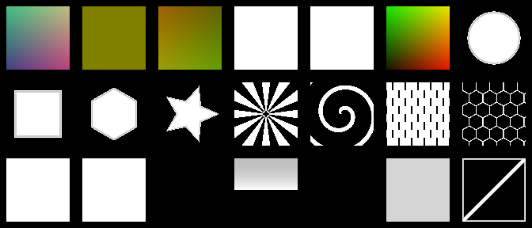

# Built-in node pack

The canvas now offers 48 visible nodes, plus hidden Parameter and Preview Vector helpers. Socket color indicates data type: yellow color, gray scalar, blue UV coordinates, cyan normals, green surface. Drag from either end; compatible-node menus and clipboard operations use the same core catalog.

## New nodes

| Node | Inputs → output | Controls/defaults |
|---|---|---|
| Value | scalar output | Value, initially 0 |
| Time | scalar output | `_Time.y × speed + offset`; speed 1, offset 0 |
| UV Transform | UV → UV | Tiling (1,1), offset (0,0); unconnected UV uses UV0 |
| Polar UVs | UV → UV | Center (0.5,0.5), radial scale 1, angular repeats 1; U = twice distance from center, V = angle in turns + 0.5. At the center, V is 0.5. |
| Rotate UVs | UV, scalar angle → UV | Center (0.5,0.5), angle 0 degrees; connected angle overrides the control. Positive angles rotate coordinates counterclockwise, so the sampled image rotates clockwise. |
| Object Planar UVs | UV output | Local mesh X/Z coordinates; follows object transforms, not an undeformed skin bind pose. |
| World Planar UVs | UV output | World X/Z coordinates; objects move through the pattern. |
| UV Scroll | UV, scalar time → UV | Speed (0.1,0); unconnected time uses shader time |
| Ramp | number → number | Black point 0, white point 1, smoothing 0; 2–16 editable curve points, initially a straight 0–1 line |
| Noise | X, UV, Position, Time → color/value | 1D line, 2D UV noise, 3D volume or true 4D evolution. Scale 5, speed 1. |
| Musgrave | UV, Position, Time → color/value | Soft fractal, ridged or turbulence; 1–8 detail layers, detail scale and strength. 2D/3D. |
| Voronoi | UV, Position, Time → color/value | Nearest-cell distance, with randomness control. 2D/3D. |
| Checkerboard | UV, Position, Time → color/value | Alternating squares/cubes. 2D/3D. |
| Waves | UV, Position, Time → color/value | Sine bands or rings, selectable direction. 2D/3D. |
| Add | numbers/colors A/B → matching result | Missing inputs are black |
| Subtract | numbers/colors A/B → matching result | A minus B; missing inputs are black |
| Divide | numbers/colors A/B → matching result | A divided by B; missing inputs are white. Denominator magnitude is at least 0.00001; zero uses positive sign. |
| Minimum | numbers/colors A/B → matching result | Lower value of each channel; missing inputs are black |
| Maximum | numbers/colors A/B → matching result | Higher value of each channel; missing inputs are black |
| Mix | numbers/colors A/B, scalar factor → matching result | Missing A is black, B is white, factor is 0.5; a 0–1 slider with numeric entry controls factor, and connected values clamp to 0–1 |
| Emission | color, scalar strength → color | White and strength 1 by default; connect to Toon Surface's emission socket |
| Invert | number/color → matching result | Inverts components; missing input is black |
| Clamp | number/color → matching result | Clamps components to 0–1; missing input is black |

The original UV Coordinates, Texture, Color, Multiply, Toon Surface, and Output remain available. Multiply uses white for missing inputs. Connected factor/strength sockets override their inspector defaults.

## Try it

`Packages/dev.nerdrx.nxsg/Samples~/Animated Palette.nxsg` blends warm and cool colors using Noise's scalar output, then adds emission. Copy it into Assets and build. The local development project includes a copy under `Assets/NXSGExamples`.

## Current boundaries

- Reachable texture and sticker resources receive separate stable sampler properties. The first uses `_MainTex`; additional resources use `_NXSG_Tex_<hash>`. Resource assignment and runtime texture availability remain Unity material concerns.
- Noise defaults to the original scrolling 2D value noise. 1D and 3D scroll along their coordinates; 4D interpolates a fourth axis driven by Time × Evolution speed. Speed 0 freezes the pattern. New procedural nodes start with speed 0. Musgrave is a normalized layered value-noise implementation, not bit-for-bit Blender output.
- Emission adds unlit color. Bloom halos depend on the world's post-processing.
- Live preview updates unsaved edits in a temporary material after a short pause; it pauses when the window is unfocused. Build updates the saved material. Shader Time animates the built shader when the rendering environment advances shader time.
- PC Built-In backend only; VRChat client, headset, and mobile acceptance remain separate checks.

Try **Assets/NXSGExamples/Polar Palette.nxsg** in the development project for rotating radial noise. The distributable copy is in `Samples~/Polar Palette.nxsg`.

Try **Assets/NXSGExamples/Particle Sparkles.nxsg** for a radial soft-dot mask, bright additive particle color, and Particle Surface output. The distributable copy is in `Samples~/Particle Sparkles.nxsg`.

## Coordinate recipes

- Rings/radial patterns: **Polar UVs → Texture UV**. Use a repeating stripe texture; U runs outward, V runs around the center.
- Spin: **Time → Rotate UVs angle**, then **Rotate UVs → Texture UV**. Time speed is degrees per second here.
- World projection: **World Planar UVs → UV Transform → Texture UV**. Tiling controls repeats per world unit.
- Object projection: use **Object Planar UVs** for a projection that follows object movement.

Polar UVs have an angular seam and a singular center; texture filtering can reveal these. Use repeat wrapping for angular repetition. Planar projection uses X/Z only and stretches on side-facing surfaces; this is not triplanar mapping. UV operations also work with Noise. Unconnected Polar/Rotate UV inputs use UV0.

## Switch math operations

Click a math node's title (marked ▾) to switch between **Add, Subtract, Multiply, Divide, Minimum, Maximum, and Mix**, or between **Invert and Clamp**. Drag the same header to move it. Keyboard users can focus the header and press Enter or Space. Node identity, position, compatible wires, and settings are retained. Inputs absent from the new operation are disconnected; the status message reports this, and Undo restores the operation and wires together. Switching back retains the previous Mix factor value, but does not automatically reconnect a removed factor wire.

## Live material preview

The toolbar's **Live preview** switch controls a temporary material preview at the top of the sidebar. Changes settle for 0.45 seconds before compiling; moving nodes alone does not recompile. A failed graph keeps the last successful preview and shows a diagnostic. Preview shaders/materials exist only in memory and are disposed when replaced or the window closes. Opening from a material uses its property values without changing it. **Build for VRChat** remains the explicit action that saves the graph and updates generated assets. This is a material preview, not a preview on every node or an automatic scene-material update.

## Automatic math types and wire colors

Add, Subtract, Multiply, Divide, Minimum, Maximum, Mix, Invert, and Clamp infer their number/color type from connected operands. Numeric inputs yield a number; adding a color operand yields a color. Numbers can feed color inputs by repeating the value in all four channels. Color-to-number conversion is not implicit. UV vectors and surfaces remain separate types. The selected-node panel shows the current automatic type. A number-to-color wire fades from gray at its source to yellow at its destination.

An empty math chain connected to a numeric socket also becomes numeric. Otherwise, unconnected math keeps its previous default color behavior. The editor rejects a new connection if its type change would break an existing numeric consumer. Disconnecting or Undo recomputes types; inferred types are not serialized into the graph.

## Ramp: shape a noise mask

Connect **Noise value → Ramp value → Mix factor**. Black/white points remap the input, and clicking the curve lets you move or add 2–16 points inside the 0–1 square. Smoothing blends each linear segment toward a smooth transition. Curve tangent handles are normalized to linear; smoothing is controlled by the explicit Smoothing field. Equal black/white points make a threshold; reversing them inverts the input mapping. Beyond the curve's first/last point, output holds the endpoint value. **Reset curve** restores the straight mapping.

Try `Assets/NXSGExamples/Noise Ramp.nxsg`, also shipped under `Samples~`. Ramp outputs a number; it is not a multi-color gradient node.

## Sidebar and UV switching

The Add menu has collapsible **Inputs, Coordinates, Textures, Math, Color, Animation, Surface** categories. Search includes names, aliases, descriptions, and category names, and opens matching categories. Search and expansion state survive normal editor rebuilds. Selected-node controls are above the library.

All seven UV/coordinate headers also offer the operation dropdown. Compatible UV wires and settings survive switching; unavailable inputs are disconnected and can be restored with Undo.

## Surface and effect nodes

The extended Built-In backend supports these portable operations. Surface nodes
produce a surface value for **Output**; effect nodes produce typed values that
can feed a surface or another effect.

| Node | Contract | Backend caveat |
|---|---|---|
| Unlit Surface | Albedo, emission, opacity, displacement → surface | Ignores scene lighting. Base opacity is cutout via Cutoff; a Shell layer uses transparency. |
| PBR Surface | Albedo, metallic, roughness, normal, emission, opacity → surface | Uses Unity Built-In BRDF with main light, spherical-harmonic ambient, and one reflection probe. No ForwardAdd or lightmap pass is emitted. |
| Fresnel | Scalar output; power control | View-dependent rim factor; power is clamped by shader math. |
| Color Ramp | Value → color | 2–8 ordered RGBA stops, linear interpolation. Native gradient editing; output holds endpoint colors outside the stop range. |
| Layer | Base, overlay, mask → color | Mask is clamped to 0–1. |
| Sticker | Base color, UV, mask → color | `resourceId` binds a separate texture property; multiple sticker and texture resources are allowed. |
| Dissolve | Value, threshold → mask and edge; edge-width control | Surface integration must use opacity/cutoff semantics; it is not a geometry deletion pass. |
| Flipbook | UV, time → UV | Rows, columns, and speed select animated cells. |
| Distortion | UV, strength, mask, time, flow → UV and offset | Noise, waves, swirl, ripple, flow map, pixelate and lens; see controls below. |
| Gradient | UV → value/color | Linear, radial and angular masks with center, direction and radius. |
| UV Tile / Mirror | UV → UV | Repeat, mirrored repetition or clamp with tiling and offset. |
| Posterize | Value, levels → value | Quantize a 0–1 mask to 2–256 evenly spaced levels. |
| Vertex Motion | Time, strength → displacement | Normal displacement follows an analytic sine wave. Texture inputs evaluated in the vertex stage use explicit LOD 0. Expand renderer bounds for large offsets. |
| AudioLink | Band, gain, smoothing, fallback → scalar | Uses the official `_AudioTexture` layout when available. Smoothing is normalized 0–1: 0 is least smoothed/raw and 1 is most smoothed. `_NXSG_AudioLinkPreview` and `_NXSG_AudioLinkValue` provide editor preview data. |
| Surface Particles | Base surface, albedo, emission, opacity, mask, time → surface | GPU geometry pass emits looping particles from the mesh wearing the material; no separate mesh. Density is per triangle, motion follows current pose, bounds remain unchanged. |
| Particle Surface | Albedo, emission, opacity → surface | Particle-facing surface. Blend mode 1 is additive; opacity defaults to 1 and soft distance to 0 (off). Optional soft intersection uses camera depth. Renderer COLOR multiplies particle color and alpha automatically. |
| Particle Color | Renderer COLOR → color and alpha | Reads Unity's per-particle RGBA stream, including Color over Lifetime. Do not multiply it into albedo or opacity again. |
| Shell | Base surface, layer surface, offset → surface | Accepts nested Shells in Base or Layer, up to 8 transparent passes. Base chains keep each offset relative to the original mesh; nesting in Layer adds ancestor offsets. Layers render in graph order, base first. Each leaf retains its own surface settings; only the first base surface casts shadows. Extra passes increase draw calls and overdraw; bounds and transparent sorting need review on each mesh. |

AudioLink support does not install or require the AudioLink package. Missing or
too-small textures return the node fallback. A correctly sized but stale
texture can still read zero; live runtime data requires an AudioLink provider.

PBR uses Unity's Built-In BRDF with the main light, spherical-harmonic ambient,
and one reflection probe. The generated pass does not add ForwardAdd or lightmap
passes. Normal maps decode tangent-space input using the mesh tangent basis.

Patterns are flat groups over ordinary nodes and wires. **Patterns → Group selection** folds selected nodes into one card with boundary sockets. Expand reveals the original nodes; ungroup keeps them. **Save selection as Pattern** exports a bounded `.nxsg` snippet; **Insert Pattern** makes a new independent group with fresh node IDs. These copies are not linked instances of an external asset.

## Preview an intermediate result

Select a node, choose **Preview output**, then **Preview selected node**. Numbers, colors, UV coordinates, tangent normals, and surfaces can be inspected without changing the output connection or saved material. With Live preview enabled, edits update that selected output. **Back to material preview** restores the whole graph. UVs appear as red/green channels; normals map −1…1 to 0…1. Only the sidebar preview is rendered, not a thumbnail on every card.

## Ready-made effect examples

Open `Assets/NXSGExamples/Nested Hologram.nxsg` for two shell layers, or `Audio Hologram.nxsg`, `Noise Color Ramp.nxsg`, or `Animated Sticker.nxsg` in the development project. Distributable copies live under `Samples~`. The sticker sample uses a white placeholder; assign a transparent atlas in its texture picker. Audio Hologram has a nonzero fallback, so its shell remains visible without music.

## Coordinate choices and procedural dimensions

UV Coordinates, Texture, Polar UVs and the procedural nodes expose a Coordinates dropdown: mesh UV0–UV3, Object XZ, World XZ, Polar, Panosphere and Matcap. A connected UV wire overrides it. For 3D/4D procedures, use Position input or choose Object/World position space. 1D Noise uses X input, falling back to UV.x. Unused dimension inputs do not affect the result.

Mesh UV and Polar mappings do not depend on the camera. Panosphere uses viewing direction; Matcap uses the view-space normal, so both intentionally respond to the camera. Missing mesh UV channels read zero. Object/World planar modes project XZ and can stretch on side faces. Polar has a seam and a singular center. UV Distortion remains a separate connectable node.

These coordinate choices use [Poiyomi's documented UV options](https://www.poiyomi.com/) as workflow context; NXSG's implementations are independent. This is not complete Poiyomi shader parity. Animated noise can make an otherwise fixed mapping appear to move: freeze Speed to check alignment. Object coordinates follow transforms and the supplied skinned vertex positions, not an undeformed bind-pose texture space.

4D Noise interpolates 16 lattice corners. Voronoi searches 9 cells in 2D or 27 in 3D; Musgrave adds up to 8 octaves. Shells multiply the shading work. These are algorithmic costs, not measured GPU timings. Try `Assets/NXSGExamples/4D Clouds.nxsg` for an evolving volume.

## Distortion controls

Use **Distortion UV → Texture UV** or feed it into a procedural pattern. Chain several Distortion nodes for combined effects. The **offset** output is the UV displacement alone, useful for debugging or reuse.

- **Noise / turbulence:** directional scrolling, scale and 1–6 detail layers. Detail 1 preserves the old UV Distort noise formula with default direction and axes.
- **Waves:** sine offsets with wave direction, scale and speed.
- **Swirl:** rotate around Center inside Radius, with adjustable edge falloff. Strength is in radians; animate it with a connection.
- **Ripple:** animated radial waves, radius, falloff, frequency and speed.
- **Flow map:** connect Texture Color to Flow. Red/green encode horizontal/vertical offsets: 0.5 is neutral, 0 is negative and 1 positive. Import flow textures as linear data. Animate their upstream UVs if needed.
- **Pixelate:** sample grid cell centers; Scale is the grid density and Strength blends from original to snapped UVs.
- **Lens / bulge:** bounded radial bulging. Negative strength reverses the displacement.

Mask is clamped to 0–1, and Axis strength scales horizontal/vertical displacement independently. Zero strength or zero mask returns the original UV exactly. Time connections override the clock for the animated modes. Swirl and lens respond to animated strength; flow responds to its supplied map. Repeat/mirror/clamp with the separate UV Tile / Mirror node as desired. Explicit wrapping can introduce derivative seams at tile boundaries.

The new **Ripple Tiles.nxsg** example combines Gradient masking, Ripple distortion, mirrored UVs, Waves, Posterize and Color Ramp. Each fractal detail layer adds noise evaluations; repeated shells multiply that cost. These nodes warp texture coordinates, not the silhouette or background behind a transparent material.

## Signal, color and UV toolkit

These 20 nodes are available from the categorized node library and connected-node search.

| Node | Use |
|---|---|
| Absolute | Turn negative values positive; works on numbers and color channels. |
| Power | Shape contrast using an exponent; uses absolute base with a small zero guard. |
| Square Root | Lift dark signals; negative inputs become zero. |
| Sine | Oscillate from −1 to 1; radians, 6.283 per cycle. |
| Cosine | Same oscillation starting at 1. |
| Fraction | Repeat the fractional part of a value, including negative values. |
| Round Down | Step down to the integer below. |
| Round Up | Step up to the integer above. |
| Round | Nearest integer; exact halves round upward. |
| Step | Hard threshold: zero below the threshold, one at/above it. |
| Smoothstep | Smooth threshold between two edges; reversed edges reverse the mask. |
| Remap | Map one numeric range to another without clamping. |
| Ping Pong | Bounce a signal between zero and a chosen peak. |
| Split Color | Extract red, green, blue or alpha as a number. |
| Combine Color | Build a color from four numeric channels. |
| Luminance | Convert RGB to a weighted brightness signal. |
| Contrast | Adjust RGB around a pivot; preserve alpha. |
| Saturation | Blend between grayscale and original RGB; preserve alpha. |
| Split UV | Extract horizontal U or vertical V. |
| Combine UV | Build coordinates from independent horizontal/vertical values. |

The nine basic math nodes automatically switch between numbers and colors. Connected inputs override their inspector values. Related unary math nodes can be changed in the node-header menu; Power also appears in the arithmetic menu. `Time → Sine → Remap` makes an adjustable pulse; `Noise → Smoothstep` sharpens a mask; `Split UV → math → Combine UV` builds custom coordinate effects.

Dragging a wire into empty space opens a searchable compatible-node menu. Nodes with multiple compatible sockets are grouped so you can choose the exact destination. Slider tracks keep convenient ranges; the adjacent delayed number fields accept finite values beyond them. Mathematical requirements and shader saturation still apply.

## Visual toolkit and wireframes

| Nodes | Use |
|---|---|
| Position, Normal Direction | Object/world coordinates and mesh surface direction. |
| View Direction, Camera Distance, Screen UVs | Camera-relative effects and screen projection. |
| Vertex Color | Painted mesh RGB and alpha. |
| Circle Mask, Box Mask, Polygon Mask, Star Mask | Procedural shapes with adjustable outlines. |
| Radial Rays, Spiral | Rotating rays and curved spiral masks. |
| Brick Pattern, Hex Grid | Staggered bricks and honeycomb outlines. |
| Triplanar Texture | Three-axis object-space texture projection; no authored UVs required. |
| Matcap Texture | Camera-facing normal projection for stylized shading. |
| Rim Glow | Colored silhouette highlight; connect to Emission. |
| Height Mask, Slope Mask | Position or surface-orientation masks. |
| Distance Fade | Camera distance mapped from white near to black far. |
| Wireframe | Anti-aliased actual triangle edges, including triangulation diagonals. |

Wireframe outputs a mask; it does not force transparency on the whole material. Connect it to a mix factor, emission or opacity. Width and softness are measured in screen pixels. The built-in surface and shadow passes use geometry-generated barycentric coordinates; vertex displacement and emitter-mask use are rejected because this is a pixel effect. Use it on Toon, Unlit, PBR or Shell surfaces. Particle Surface and generated particle inputs are rejected; a Surface Particles Base may still use Wireframe. Native Windows/stereo behavior remains unverified. **Neon Wireframe** is a ready-to-open example in NXSGExamples and Samples~.

Montage rows, left to right: Position, Normal Direction, View Direction, Vertex Color, Camera Distance, Screen UVs, Circle Mask; Box Mask, Polygon Mask, Star Mask, Radial Rays, Spiral, Brick Pattern, Hex Grid; Triplanar Texture, Matcap Texture, Rim Glow, Height Mask, Slope Mask, Distance Fade, Wireframe. Black rim/slope tiles are expected for the flat camera-facing test quad; texture nodes use a white fixture texture.
