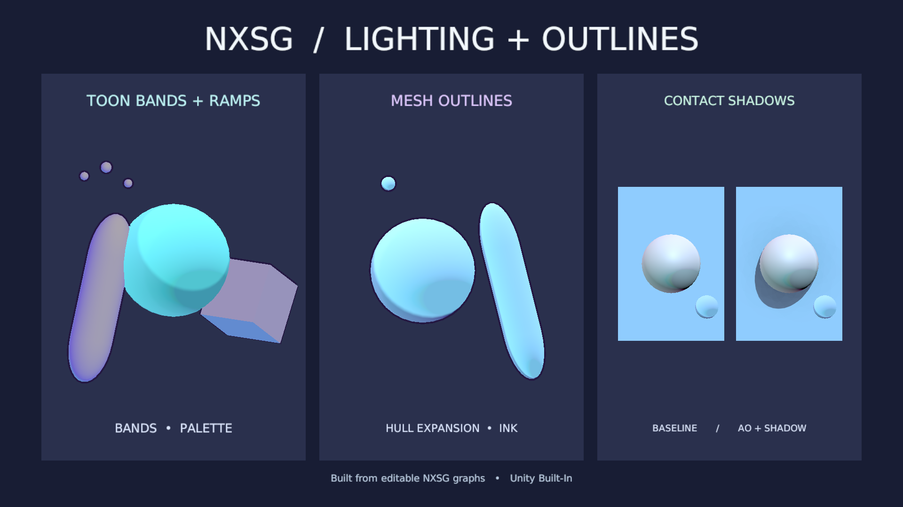

# Rendering features

This guide describes NXSG's Built-In rendering controls and the constraints
that affect their use. The editor writes a ShaderLab state on **Output** and
adds passes for features that need separate geometry, such as **Outline**.
Screen-depth lighting samples the camera depth texture inside existing surface
passes; NXSG neither creates a separate pass for it nor requests camera depth
generation. This page covers generated graph behavior; it does not establish
Unity, VRChat, headset, or target-GPU acceptance for every project.

Actual Linux Unity renders produced by
[`RenderingShowcase`](../Tests/Editor/RenderingShowcase.cs). The right-hand pair
shows the same scene with camera-depth AO/contact shadows disabled and enabled.
See the [validation record](VALIDATION.md) for the separate numerical checks
and platform boundaries.

## Toon lighting

Select a **Toon Surface** and choose **Shading**:

| Mode | Controls and behavior |
| --- | --- |
| Threshold | A soft transition controlled by threshold, softness, and shadow strength. |
| Multiple bands | Quantizes direct lighting into 2–8 bands. Connected Shade Map shifts the band boundaries; connected Shadow Tint supplies the dark-side color. |
| Texture ramp | Samples the assigned 2D texture from shadow at X=0 to light at X=1. Ramp Row selects Y. Shade Map shifts the sample coordinate. |

The **Shade Map** socket accepts a scalar. `0.5` leaves the light coordinate
unchanged; darker values move the boundary toward lit areas, while brighter
values move it toward shadow. A wire takes precedence over the inspector
control. The ramp's RGB affects direct light. Ambient light and emission remain
separate. Use clamp wrapping to avoid sampling across a repeating edge.

The default ramp resource is a portable white placeholder. Assign a ramp in the
node texture picker before building if a color response is required. The
[Toon Outline example](../Packages/dev.nerdrx.nxsg/Samples~/Toon%20Outline.nxsg)
demonstrates multiple lighting bands and a connected Shade Map; it does not use
Texture ramp mode.

## Outline pass

**Outline** takes a completed mesh surface through **Base**, then outputs a
surface for **Output**. NXSG emits one additional inverted-hull pass. Width is
in world metres; Width Mask scales it per vertex; Outline Color supplies the
hull color. Smooth mesh normals make continuous contours. Split or hard normals
can produce discontinuities or visible thickness changes.

The pass adds draw and vertex work for the rendered mesh. It expands the base
surface hull; it does not expand fur shells, fur fins, particle geometry, or
surface particles. Check mesh bounds and the target camera/mirror views when
using wide outlines.

## Camera-depth lighting

**Screen Space AO** returns visibility for the lit surface's **Occlusion**
input. **Contact Shadows** traces camera-visible depth toward the current light
and returns visibility for the lit surface's **Shadow** input. Both expose
sample tier, distance/radius, strength, thickness, and bias controls. A wired
input replaces its inspector value. Their shader work runs in existing surface
fragment passes; they add no geometry or render pass.

These are screen-depth effects. They only see geometry represented in the
current camera depth texture; hidden and off-screen geometry cannot contribute.
Missing or unusable depth returns neutral visibility. The camera or rendering
environment must provide depth. Unity's camera depth texture generation has
its own rendering cost, but these nodes do not request or generate it. They do
not replace baked occlusion or shadow maps. See the
[screen-space lighting notes](SCREEN_SPACE_LIGHTING.md) and Unity's
[Built-In depth texture documentation](https://docs.unity3d.com/2022.3/Documentation/Manual/SL-CameraDepthTexture.html).

**Light Volumes** samples indirect diffuse and specular from the optional VRC
Light Volumes integration. The package is optional; see [setup and supported
outputs](LIGHT_VOLUMES.md). The node already includes its supplied albedo.
Connecting its Color output to an Unlit surface avoids adding the result to a
second ambient-lit response.

## Texture and visibility nodes

- **Cubemap** samples a project cubemap using a world-space direction. When no
  direction is connected, it reflects the view direction about the surface
  normal. LOD selects a mip. Pick the cubemap from the node's texture field;
  the generated material exposes a texture slot.
- **Texture Array** samples a `Texture2DArray`. Slice is rounded down and
  clamped to a valid layer; LOD selects a mip. Assign an array in the node's
  texture field and use its Material slot in the generated material.
- **UV Tile Discard** tests the integer tile containing the supplied mesh UV.
  Connect its Visibility output to a surface Opacity input and choose a Cutoff
  above zero. The node discards fragments in the color and shadow/depth paths;
  it does not remove mesh triangles.

Textures are project/material resources. An unassigned placeholder keeps a
sample graph portable but must be replaced to show meaningful cubemap or array
content.

## Output render state

**Output** controls the generated material's render state:

| Control | Effect |
| --- | --- |
| Rendering | Automatic preserves the surface's mode; Opaque, Cutout, Alpha Blend, and Additive select a mode. |
| Visible Faces | Selects front-face, back-face, or two-sided rendering. |
| Depth Write and Depth Test | Set ZWrite and ZTest behavior. Automatic follows the render mode; alpha blend and additive turn depth writing off by default. |
| Queue Offset | Moves the render queue within the editor's bounded offset range. |
| Stencil | Enables a stencil test/write configuration with reference, read/write masks, compare, and pass operation. |

Stencil state is shared with other scene materials. Coordinate values with
other shaders, and confirm the camera target has a stencil buffer. Values do
not carry between separate camera render targets. Blend, depth, culling, and
stencil are standard ShaderLab render-state controls; see Unity's
[ShaderLab command reference](https://docs.unity3d.com/2022.3/Documentation/Manual/shader-shaderlab-commands.html).

Alpha blending depends on draw order and can sort incorrectly for intersecting
or nested transparent surfaces. Disabling depth writes can change how later
geometry is occluded. Choose Cutout for binary visibility and a depth-writing
surface where that matches the material. Opaque forces output alpha to one and
ignores the surface opacity and albedo-alpha controls; choose Cutout or a blend
mode when those values should affect visibility.

## Included examples and related guides

- [Toon Outline](../Packages/dev.nerdrx.nxsg/Samples~/Toon%20Outline.nxsg):
  multiple-band Toon lighting, connected Shade Map, and an outline pass; it
  does not demonstrate Texture ramp mode.
- [Depth Lighting](../Packages/dev.nerdrx.nxsg/Samples~/Depth%20Lighting.nxsg):
  screen-space AO and Contact Shadows connected to a PBR surface.
- [Audio Spectrum Bars](../Packages/dev.nerdrx.nxsg/Samples~/Audio%20Spectrum%20Bars.nxsg):
  AudioLink spectrum bars driving emission with preview controls.

Other integration details: [AudioLink data nodes](AUDIOLINK_DATA_NODES.md),
[screen-space lighting](SCREEN_SPACE_LIGHTING.md), and [VRC Light Volumes](LIGHT_VOLUMES.md).
