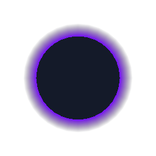

# Surface details

These controls extend the regular PC Built-In surfaces. Open **Window → NXSG →
Example Gallery** for Soft Aura, Triangle Disintegration, and Prismatic Gem.

## Soft Outline

Connect a surface to **Soft Outline → Base**, then its output to **Output**.
The additional geometry pass creates feathered fins at smooth-normal silhouette
crossings. It does not need bloom or world post-processing.

- **Width units:** world units or screen pixels. World width is independent of
  object scale; pixel width is approximate at steep perspective angles.
- **Color, opacity, falloff:** tint and soften the aura. Higher falloff makes it
  fade faster away from the mesh.
- **Mask:** controls fin width. Color, masks, and width can be wired to graph
  inputs, including AudioLink.

This follows normal-defined silhouettes, not the edges of an alpha-cutout
texture. Coarse meshes and split/hard normals can produce gaps. Increase
renderer bounds if fins disappear at screen edges. Generated fur and particles
are not outlined. The existing inverted-hull Outline remains available.

## Geometry Dissolve

Connect a surface to **Geometry Dissolve → Base**, then to **Output**.
**Amount** moves from the intact mesh at 0 to collapsed triangles at 1.
**Distance**, **Rotation** (turns), **Shrink**, and a world-space **Direction**
control the breakup; without a direction input, triangles travel along their
average normal. **Mask** scales the progress for each triangle.

Masks use averaged per-triangle attributes, so small texture details require
enough triangles. With Tessellation, its generated triangles are broken up in
the surface and shadow passes, increasing detail and cost. UVs stay attached to
the deformed triangles; forward lighting and cast shadows use the same breakup.
Geometry Dissolve cannot currently be combined with an Outline, Fur, Surface
Particles, or volume output.

An unwired Amount of 0 omits the geometry stage. A wired zero remains dynamic
and retains that stage. These are copies of the current pose displaced each
frame, not persistent debris or historical poses.

## Toon lighting

**Receive scene shadows** scales Unity's shadow-map contribution. It preserves
point/spot distance attenuation and light cookies. It cannot add shadows to a
world light that does not cast them.

**Shadow border tint** colors the transition between lit and shaded regions.
Width and strength are connectable. It works with threshold, multiple-band,
and layered-shadow modes; texture-ramp mode defines its own transitions.

In **Layered shadows** mode, each layer also has **Receive scene shadows**.
At 1, its shade color receives the global scene-shadow contribution as before.
Reducing it lifts the cast shadow on that layer's shaded contribution, while
the other layers and lit regions retain their own shadow response. These
controls do not change the layer's normal-based threshold or generate new
shadows. Point/spot falloff, cookies, and the graph's Shadow input still apply.

**Rim shading** blends a color into the Toon response at grazing view angles.
Width and softness shape the rim, and light alignment restricts it to the
side facing the light. It follows direct lighting and received shadows;
connect a separate Rim Glow to Emission for an independently glowing edge.
Rim strength defaults to 0 and omits the extra calculation until enabled.

### SDF Face Shadow

Feed two mirrored samples from an authored face SDF into **SDF left/right**.
The node chooses a side and adjusts the threshold with light direction. Use
its mask to mix face colors or drive a surface's shadow input. Threshold,
offset, softness, angle strength, and strength tune the result.

**Object axes** follow the renderer transform. On a combined skinned avatar,
that transform does not rotate with the head bone. **Custom axes** accepts
world-space head-right and head-forward directions from the graph; it does
not create a bone-tracking component. Use an appropriate head-local basis for
a pose-dependent face effect. This is an artistic lighting mask, not geometric
self-shadowing or automatic SDF generation.

## PBR and artistic highlights

**Specular anti-aliasing** is available on PBR and Layered PBR. It increases
roughness where screen-space normals change rapidly, including clearcoat
normals, to reduce small highlight shimmer. Zero preserves the existing shader.
It does not replace texture mipmaps or solve every source of aliasing.

**Anisotropic Highlight** supports two lobes, second-lobe roughness and tint,
tangent strength, and separate longitudinal and azimuthal width controls.
Shift-noise inputs accept procedural or texture signals. Optional probe
reflections have their own strength, roughness, and tangent stretch.
An unwired reflection strength of 0 omits the probe lookup.
This is an artistic color contribution; connect it where that contribution
belongs in your material. Normals and tangents are world space.
Longitudinal width 1 preserves the original lobe; higher values broaden it.
Azimuthal width 1 is fully open, and values below 1 narrow it around the strand.
The second shift remains relative to the primary shifted tangent for existing
graph compatibility. A probe-enabled highlight is fragment-only.

**Subsurface** provides connectable strength, tint, thickness, view response,
and thickness attenuation. **Additional spread** widens the wrapped light
without changing thickness; **Light distortion** bends the scattering light
toward the normal. Negative distortion bends it in the opposite direction.
**Scene shadow response** controls how much received shadow suppresses the
added scattering, leaving the base color alone. It needs a shadow-casting
scene light and is inactive outside forward lighting passes. When enabled or
wired, it cannot feed displacement or particle emitter inputs.

Spread, distortion, and scene shadow response default to 0, preserving older
graphs. These are light-direction and thickness approximations; they do not
trace light through the mesh or create self-shadowing in an unshadowed world.

## Depth Rim

Depth Rim returns an edge mask from four nearby camera-depth samples. Width is
in pixels; bias and softness use
eye-depth units. Width 0 disables the effect. Multiply the mask by a color and
connect it to emission or another color input.

The camera must provide depth. Missing depth and oblique mirror projections
return zero. Only geometry present in camera depth contributes; transparent
objects and off-screen geometry may be absent. Plane-depth prediction reduces
false edges on tilted surfaces. This is a screen-space effect, not an outline
mesh or full-object self-shadowing.

## Gem

Gem outputs color using chromatic screen refraction and the first reflection
probe. Connect it to Unlit albedo for a starting point. **IOR**, refraction,
reflection, dispersion, roughness, and tint are connectable. A custom normal
input is world space.

**Interior sparkles** add a procedural pattern sampled at four points along
the refracted view direction in object space. Strength, density, size, depth,
and color are connectable. Depth changes the sampled interior path and its
parallax, rather than measuring the back face of the mesh. Strength defaults
to 0; when unwired, this removes the additional helper and evaluation.

This adds a named GrabPass and multiple texture samples. It does not simulate
internal bounces, thickness, caustics, or raytraced scene geometry. Screen
contents and transparency sorting affect the result. Interior sparkles are
an artistic approximation, not internal reflection rays. Reflection needs an
appropriate environment/probe. See **Prismatic Gem** in the gallery.

## Delayed-pose afterimages

True arbitrary afterimages need stored earlier skinned poses. The supported
material-only path does not currently provide that history. NXSG does not add
a placeholder node that merely offsets the current mesh. The investigation and
acceptance criteria are recorded in [Afterimage history](research/AFTERIMAGE_HISTORY.md).
