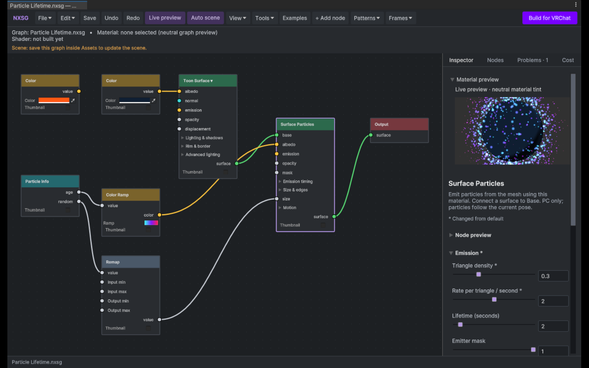
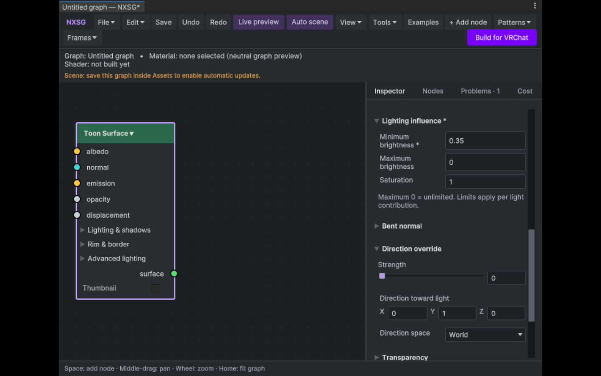
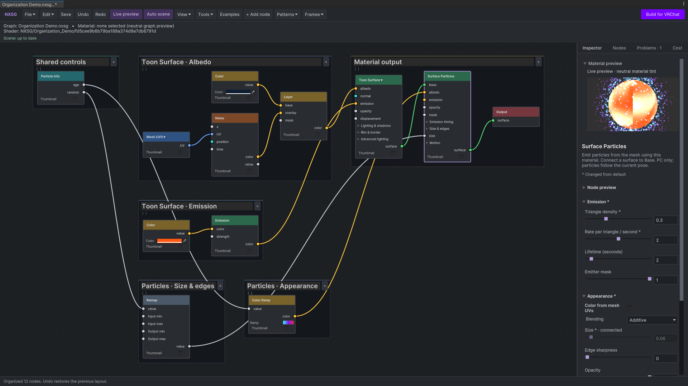
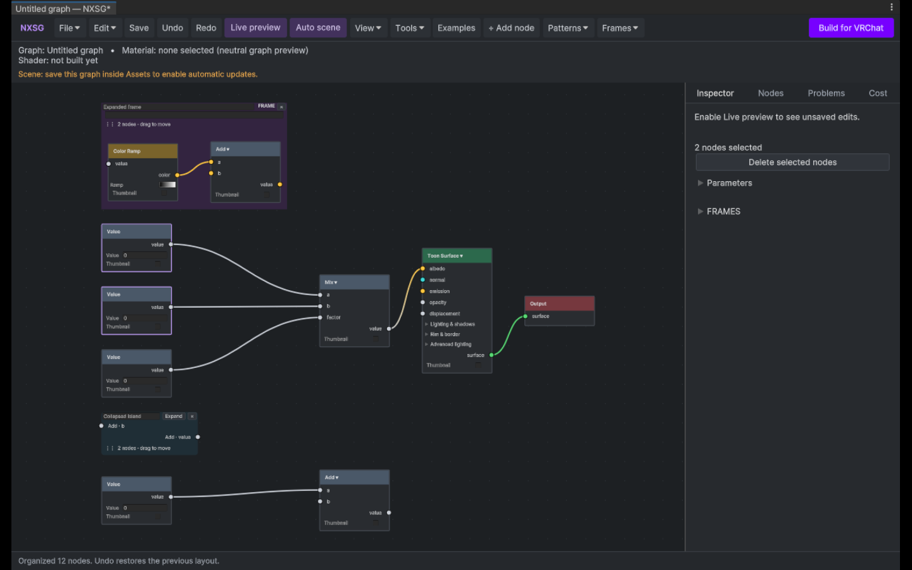

# Editor UI — versions 2.0–2.1.1

Current editor behavior, with dated checks below. [Creator workflow](CREATOR_WORKFLOW.md) covers the menus and everyday editing tools.

Reviewed the actual Unity 2022.3.22f1 Linux editor using compositor captures in headless Gamescope. Focus: dense particle controls, the minimum window size, node labels, and the connected-node picker.

- Graphite panels, 3 px node corners, subtle canvas dots, and solid type-colored node headers.
- NX violet marks Build for VRChat, active toggles, focus, and selection; node headers and sockets retain distinct, richer colors.
- Shared toolbar/button spacing and inspector field spacing. Build stays at the right of the wrapping toolbar.
- Particle inspector settings are grouped into expandable Emission, Appearance, Lifetime curves, Motion, and Setup and limits sections. The canvas groups optional particle sockets by Emission timing, Size & edges, and Motion.
- Selected sidebar tab has a visible underline; tabs share available space.
- Inspector labels wrap within their column instead of displacing inputs.
- Material preview fits available width and can collapse; its state survives inspector rebuilds.
- Selected-node controls appear before frame controls.
- Connected-node picker accounts for its full height and canvas bounds, keeps the search field inside its border, and scrolls choices.
- Long node headers and port labels use ellipsis; operation/socket tooltips retain context.
- Shorter initial status hint; existing interactions remain available.
- Particle Lifetime sample node positions no longer overlap.
- Inspector sections remember their open state by graph, node, and section while the inspector rebuilds. Common controls stay open; optional depth/order, transparency, stencil, lighting, and advanced controls start collapsed.
- A `*` marks a value changed from a new node's default; a section `*` means at least one setting inside differs. These default markers are separate from the graph's unsaved-edits state.
- XYZ vector controls use a full-width label with one full-width row of X, Y, and Z components so the fields remain legible in a narrow inspector.
- Layered PBR sockets are grouped into lighting, clearcoat, and sheen groups. Particle sockets are grouped by purpose. Connected optional sockets stay visible even when their group is collapsed.

Inspector v2 capture: default-change markers, compact Toon controls, and full-width vector fields.

## Checks

`EditorPolishCapture` exercises wide and 850×500 layouts, numeric field bounds, preview collapse, and a picker opened at the bottom-right canvas edge. `InspectorPolishSmoke` checks fresh defaults across 181 nodes, live default markers, Undo, and section state. `SurfaceSocketFoldoutSmoke` checks grouped sockets and connected-input visibility for Layered PBR and Surface Particles. Packaging checks also pass.

These checks cover the Linux editor fixture and its current display scale, not every OS/theme/DPI combination. Dense inspectors still scroll; the preview is collapsible to reclaim space. Opening a graph does not rearrange its positions; organization runs only when requested.

## Canvas organization and snapping — 2.1.1

Whole-graph organization now creates labelled frames by surface input. Shared
controls, particle branches and material outputs stay distinguishable. Small
value chains sit near their consumers, and frames pack into rows. Automatic
frames have larger headings and muted backgrounds; renaming one makes it a
manual frame that later organization preserves.

`BranchOrganizeSmoke` checked a 44-node/50-connection graph, repeat stability,
frame bounds and Undo/Redo. `BranchGroupsSmoke` checked shared inputs, manual
frames, renamed frames and unknown imported metadata.
[Recorded checks](VALIDATION.md#branch-organization--2026-09-29).

### Layout and drag checks

The Tools menu can organize the whole graph or a selection. Layout uses measured
node bounds, preserves complete groups, and records one Undo step. The View menu
has optional 24-unit grid snapping, with Alt for free movement. Group drags use a
shared offset. Expanded frame backgrounds now draw behind their wires.

Verified on Unity 2022.3.22f1 Linux in an isolated headless Gamescope session:

- `GraphOrganizeSmoke`: varied node sizes, disconnected branches, cycles,
  repeatable layout, a 500-node chain, group preservation, unchanged shader
  semantics/connections, selected-only movement, and Undo/Redo.
- `GridDragSmoke`: pointer events at 150% zoom, grid snapping, Alt bypass,
  click without a dirty edit, repeated collapsed Pattern drags, visible frame
  member movement, and single-step Undo. The test restores the snapping preference.
- Actual editor capture reviewed for spacing and visible wires inside frames.

Organization runs only when requested. These checks do not establish Windows,
VRChat, or every display-scale behavior.
