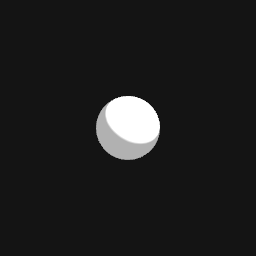
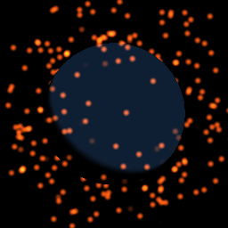
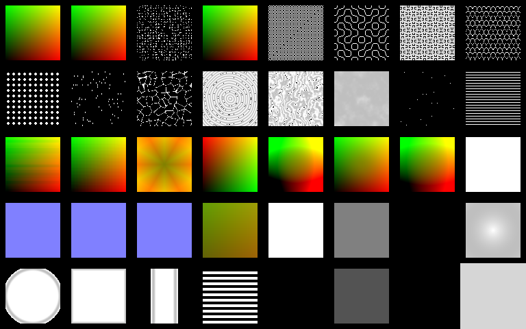
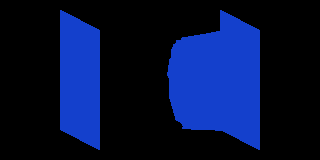
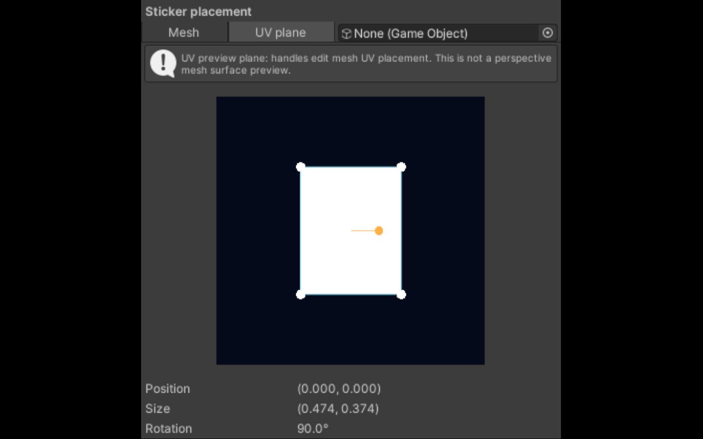
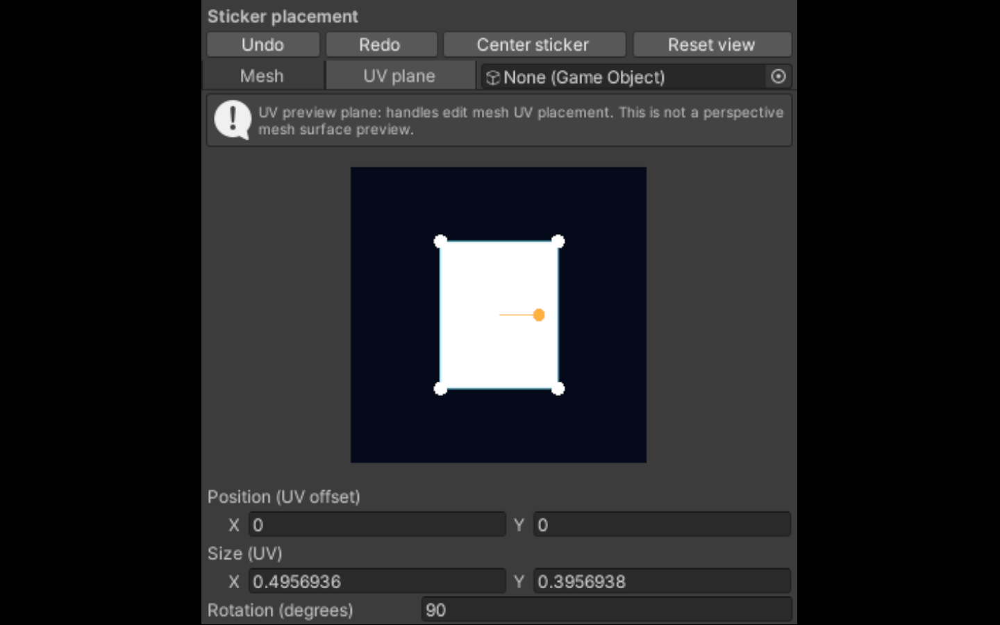
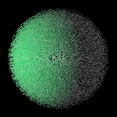
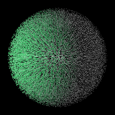
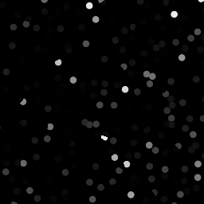
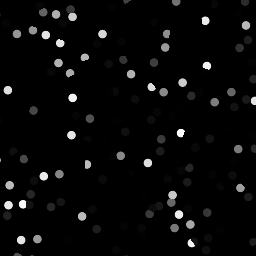

# Validation record

**Current status (2026-09-19):** Linux Unity/OpenGL checks are the current
evidence baseline. Windows/D3D, headset stereo, and live VRChat client checks
remain open. The dated sections below are append-only evidence records; the
older opening sections describe the initial implementation slice and are
historical context, not the current acceptance boundary.

**Initial implementation slice (historical, 2026-09-17):** This records
implementation evidence, not completion of the full design or roadmap.

## Environment

| Component | Exercised configuration |
| --- | --- |
| Authoring OS | CachyOS Linux, kernel 7.2.5-1-cachyos |
| Unity | 2022.3.22f1, revision 887be4894c44 |
| SDK fixture | VRChat Base and Avatars 3.10.5; official archive SHA-256 values verified |
| Unity JSON dependency | `com.unity.nuget.newtonsoft-json` 3.2.1 |
| Portable host | .NET SDK 8.0.425; Newtonsoft.Json 13.0.3; same core/backend sources |
| Graphics | OpenGLCore, AMD Radeon RX 7900 XTX, radeonsi/ACO |
| Hidden display | Gamescope 3.16.25, 1440 × 900, 30 Hz |

Unity needed `libxml2.so.2` on this rolling distribution. A signed Arch `libxml2-legacy` 2.13.9-2 package was extracted into local test tools and provided through the process library path. System libraries were not changed. The bundled licensing helper failed to start; opening the installed Hub supplied a working 1.17.4 helper. No license modification or activation bypass was used. On first open, Unity removed orphan SDK metadata and generated XR settings inside the local fixture. Rerunning setup detects and preserves that changed tree; the archive hashes describe the downloaded originals.

## Passed automated checks

The [portable harness](../Tests/Portable/Program.cs) checks deterministic JSON, layout-independent semantic hashes, unknown-node preservation, unsupported node-version rejection, malformed input, duplicate/trailing JSON, enum/nonfinite validation, resource traversal, cycles, port types, a 4,096-node chain, and emitter behavior. Emitter cases cover constant colors, unused math, mutable color multiplication, property-name collisions and hostile identifiers. Preflight rejects expression depth above 64 and expanded traversal work above 8,192 visits before recursive lowering; identifiers and total generated source are bounded. Adversarial chain and repeated-input DAG tests exercise those limits.

The [Unity harness](../DevProject/Assets/Editor/NxsgSmoke.cs) compiled and ran in the pinned editor. Its [machine-readable result](evidence/2026-09-17-linux-smoke.json) records:

- Matching core roundtrip and semantic hashes using Unity's resolved Newtonsoft assembly.
- SDK manifests and Base/Avatars assemblies present at the pinned versions.
- Generated opaque toon shader imported, supported and rendered to a texture with a visible non-error subject.
- Explicit `Material.SetPass` checks for generated passes with synchronous compilation on the active renderer.
- Build action created shader/material output and retained their GUIDs across rebuilds.
- Material color and texture references survived rebuilding.
- Injected failures after shader promotion and after material promotion restored both original files byte for byte.

The small sphere is an actual Unity camera capture, not a design mockup. It establishes a basic rendering path, not visual parity with other toon shaders.

## Editor checks

The custom UI Toolkit canvas opened in the pinned Linux editor on a hidden display. Pointer dragging moved the node and redrew its edges. Toolbar undo/redo restored the node position. A user-interface Build action updated the material preview. The search query `anime` offered Toon Surface. Add-node and toolbar undo were also exercised. [Actual editor capture](assets/editor-preview.png). Keyboard undo was not reliable in this environment, matching the creator's existing Unity experience; visible Undo/Redo controls remain the supported path. Closing the hidden test editor through its explicit control signal completed with exit code 0.

The hidden-display setup also exposed a Gamescope/libei event failure during one interactive run. Graphics batch checks completed successfully. This distinction matters when reproducing input automation on this distribution.

## What remains open

This is a development prototype: one sampled texture, UV0, color expressions and opaque toon output. The basic Add/search UI supports curated aliases, not general fuzzy intent matching. Preview updates after an explicit successful build. Some backend inputs are available through graph files before they have editor controls.

Remaining S00–S04 work includes the standalone assembly packaging contract, migration/paste flows, full source-map diagnostics, 20/200-node interaction measurements, GraphView comparison, multi-selection, edge hit testing, keyboard/accessibility coverage, richer property editing, incremental previews and crash-recovery tests across actual process interruption. The tested rollback checkpoints are exceptions within one process, not a simulated machine crash.

No VRChat avatar upload, SDK avatar acceptance, live client, headset, mirror/stereo parity, native Windows, mobile device, VRCFury or AudioLink test has been performed. Fur, animation, Patterns, baking and the Blender bridge remain planned. Passing a basic Linux rendering check does not close those gates.

See [development setup](DEVELOPMENT.md) for reproducible commands and [implementation plan](IMPLEMENTATION_PLAN.md) for the remaining acceptance criteria.

## Socket interaction update — 2026-09-17

The custom canvas now uses edge sockets and per-operation header colors. A separate minimal Unity 2022.3.22f1 project ran `Tests/Editor/SocketInteractionSmoke.cs` inside headless Gamescope, sending UI Toolkit pointer/key events to the real canvas. Dragging from either endpoint, click-click connection replacement, mismatched-type rejection, the compatible-node menu on empty drops, spawning and connecting in both directions, Escape cancellation, selected-node outlines, box selection, group dragging/deletion, and Undo passed. These are synthetic editor interaction checks, not a user usability study.

## Clipboard update — 2026-09-17

The portable checks exercise clipboard resource/parameter remapping, cross-graph paste, fresh IDs, layout offsets, oversize/duplicate/unresolved-reference rejection, and unchanged targets on failure. The hidden Unity interaction check also exercises Ctrl+C/V/D, copied internal wires, excluded external wires, paste Undo, clipboard preservation during Duplicate, text-field shortcut isolation, and invalid clipboard rejection. Copy/paste is limited to currently supported core node versions, 1 MiB of clipboard JSON, and 1,024 nodes per snippet.

## Color correctness and editing context — 2026-09-17

A real graphics regression check (`Tests/Editor/ColorRenderSmoke.cs`) renders a red constant through Multiply and Toon. The sampled center pixel is RGBA(1,0,0,1); the previous comma-expression bug produced white. HLSL now uses vector constructors while ShaderLab property defaults retain tuple syntax. Graph previews opened directly use neutral material tint; opening through a material preserves that material as context. The header shows graph/material/shader identity and the window title includes the graph filename. Existing generated shaders must be rebuilt to incorporate the compiler fix.

## Ten-node pack — 2026-09-17

Portable checks cover each new node, default inputs, type rejection, clipboard, and the Animated Palette example. The combined graphics fixture (`NodePackRenderSmoke.Run`) compiles Time/Value, UV Transform/Scroll, a sampled texture, Noise, Mix, Add, Clamp, One Minus, and Emission together. With black albedo and no lighting, red emission remains visible; captures at deterministic times 0 and 1 differ. Both captures are in `docs/evidence`. The existing hidden UI interaction/clipboard check passes after integrating the shared node catalog. This is Unity OpenGL evidence, not a VRChat client or DX11 acceptance result.

## Coordinate nodes — 2026-09-17

Polar UVs, Rotate UVs, Object Planar UVs, and World Planar UVs passed portable validation/emission, typed angle connections, malformed-property rejection, clipboard preservation, disconnected-node elimination, and a 20-node coordinate-chain source-size check. The Polar Palette sample validates and emits. Coordinate helpers keep nested source expressions from expanding exponentially.

`Tests/Editor/CoordinateRenderSmoke.cs` ran in a separate project under headless Gamescope with Unity 2022.3.22f1 and OpenGL. It samples an encoded UV texture through emission on an X/Z quad using a linear floating-point render target. Polar center/cardinal samples, 90-degree rotation, object-space translation invariance, and world-space translation response passed (`NXSG COORDINATE RENDER CHECK PASSED`). This checks Linux rendering, not live VRChat, stereo, skinned meshes, or Windows.

## Math operation switching — 2026-09-17

`NodeSwitchSmoke.Run` passed in the isolated headless Unity 2022.3.22f1 editor. It exercises the editor's operation-change command, preserving node identity/layout/selection and compatible wires, removing Mix's factor connection on switching to Add, retaining the stored factor control, switching Invert to Clamp, and restoring operations/wires with one Undo. The header offers a native menu on click or Enter/Space; pointer dragging remains available. The automated check covers the command and Undo behavior, not native-menu pointer selection.

## Live material preview and additional math — 2026-09-17

Portable checks passed for Subtract, Divide, Minimum, and Maximum, including graph typing, defaults, and clipboard. `LivePreviewSmoke.Run` passed in hidden Unity 2022.3.22f1/OpenGL: unsaved red/green graphs render correctly, preview shader/material asset paths are empty, source context properties stay unchanged, failed graphs leave a prior preview usable, and disposal destroys preview materials. A numeric render combines all four new operations, including zero and negative denominators. Divide uses a signed minimum denominator magnitude of 0.00001 in float precision.

`LivePreviewWindowSmoke.Run` also passed: the editor's timed update creates an unsaved preview, retains it on invalid edits with a visible diagnostic, refreshes for a valid change, respects pause, preserves unsaved/source state, and disposes resources when closed. The material preview pauses while its window is unfocused. Helpers use the installed editor's documented public `ShaderUtil.CreateShaderAsset(string, bool)` and `CompilePass(Material, int, bool)` APIs. No source/generated-asset writes are part of preview creation. This does not establish live VRChat, stereo, native Windows, or intermediate-node preview coverage.

## Categories, UV switching, automatic types, and Ramp — 2026-09-17

The portable runner passes scalar/color inference, scalar demand through unbound chains, order independence, invalid connections/cycles, clipboard immutability, ramp validation, and the Noise Ramp example. Inference uses adjacency and a bounded topological walk; generated type annotations are held on private compiler node copies, not written into the authored graph.

The hidden Unity editor check (`NodeSwitchSmoke.Run`) passes UV operation changes with compatible-wire retention and Undo, categorized search and expansion persistence, numeric math promotion, rejection of a color connection that would break a numeric consumer, gradient endpoint colors, and the presence of Ramp's curve control. Native curve-popup gestures and visual gradient appearance are not covered by these programmatic assertions.

`DynamicRenderSmoke.Run` passes on Unity 2022.3.22f1/OpenGL with a linear floating-point render target: numeric Mix, mixed number/color arithmetic, scalar Invert/Clamp, safe divide with zero/negative divisors, numeric Ramp defaults, equal/reversed black/white ranges, and custom piecewise curve values. A rendering check caught unsupported Cg single-argument vector constructors; scalar promotion now uses a single-call helper with an explicit four-component constructor. Live VRChat, stereo, and native Windows remain separate validation gates.

## 2026-09-18 — Surfaces, layers, audio and reusable Patterns

Implemented 13 visible nodes (38 visible total), optional node-output previews, flat reusable Pattern groups, and multiple texture resources. Legacy simple Toon graphs retain the original lowering path. Graphs using the extended contract use bounded per-output shader functions, including separate vertex sampling and a single transparent shell pass.

Validated on **Linux Unity 2022.3.22f1, OpenGL Core, RX 7900 XTX**, inside hidden Gamescope:

- `EffectsRenderSmoke`: Unlit lighting invariance; RGBA Color Ramp interpolation; layer blending; dissolve mask/edge; two flipbook frames; sticker alpha and bounds; Fresnel center/edge; normal-map PBR compilation; visible differences from metallic and roughness; half-opacity shell blending and expanded silhouette; vertex-motion/shadow-pass compilation. All cases passed.
- AudioLink tests supply a synthetic 128×64 global texture and check exact raw and filtered band values, simulated preview values, and unavailable-data fallback. This caught and fixed the need for the official OpenGL `_AudioTexture_TexelSize` availability branch. The final check binds only the global texture, as the provider does; Unity supplies its size uniform. This is **not** live music/provider or VRChat evidence.
- `EffectsVariantSmoke`: every catalog value node through a compatible reachable surface/texture path, constants, two texture resources, and the legacy Toon chain. Active Editor passes compiled and `SetPass` succeeded; this does not enumerate every D3D/VR variant.
- `EffectsEditorSmoke`: Color/Animation library sections; gradient stops restored in the native field; selected scalar/UV/normal previews without source edits; collapsed Pattern cards and hidden member nodes; persisted grouping and toolbar Undo. Programmatic Editor checks, not exhaustive pointer/keyboard interaction proof.
- `EffectsBuildSmoke`: Audio Hologram, Noise Color Ramp and Animated Sticker built and rebuilt as imported shader/material assets. Material GUID and edited tint survived rebuilds.
- Portable checks: all node contracts, invalid stops/atlas limits, deterministic emission under reordered nodes/edges, source immutability, optional null handling, sample compilation, Pattern serialization and clipboard identity remapping. Existing portable checks pass.

Local evidence logs (ignored scratch files): `work/unity/effects-render-verified.log`, `effects-variants.log`, `effects-editor-final.log`, `effects-build.log`. Runnable fixtures live in `Tests/Editor` and `Tests/Portable`.

Limits: PBR currently provides main-light BRDF, SH ambient and one reflection probe; no additional-light/lightmap passes. Standalone surfaces use cutout opacity; the one Shell layer alpha-blends and does not cast its own shadow. Offset/motion do not expand renderer bounds automatically. Patterns are flat independent copies, not linked external subgraphs. Previews show one selected output in the sidebar. Windows, live VRChat/VR, actual AudioLink music, advanced stereo variants, and transparent-object sorting remain unverified.

## Particle materials — 2026-09-18

`Tests/Portable/ParticleChecks.cs` passes with the full portable harness. It checks node contracts, property ranges, alpha/additive states, particle fallback tagging, optional depth sampling, and explicit rejection of Particle Surface inside Shells.

`Tests/Editor/ParticleRenderSmoke.cs` passed in Unity 2022.3.22f1, Linux OpenGL under headless Gamescope (`work/unity/particle-render-verified.log`, `NXSG PARTICLE RENDER SMOKE PASSED`). It checks transparent queue and no shadow caster, alpha versus additive pixels, vertex alpha, soft intersections at a known depth gap in perspective and orthographic cameras, the disabled-depth path, Particle Color RGB through an ordinary Unlit surface, white vertex color on a mesh without a color channel, the Sparkles sample, and an actual billboard ParticleSystemRenderer with Color over Lifetime alpha changes.

This implements particle materials for Unity's existing particle system, not GPU simulation. The existing Flipbook, Distortion and AudioLink nodes remain composable; this check does not establish live AudioLink provider behavior. Mesh-particle procedural GPU instancing, native Windows/DX11, stereo VR, SDK upload and VRChat client fallback behavior remain unverified. Soft intersections require a camera depth texture; distance 0 omits depth sampling. No user scene or authored graph was changed by the hidden fixture.

## Same-mesh Surface Particles — 2026-09-18

Added the experimental **Surface Particles** decorator: existing surface → Surface Particles → Output. A geometry pass emits camera-facing quads from the original rendered triangles; it requires neither a separate mesh nor a ParticleSystem. The abandoned extra-mesh prototype is not shipped.

`Tests/Portable/SurfaceParticleChecks.cs` passes with the full portable suite: node contract/defaults, property ranges, finite values, bounded geometry output, base-pass preservation and nesting rejection. `Tests/Editor/SurfaceParticleRenderSmoke.cs` passed under headless Gamescope with Unity 2022.3.22f1/OpenGL (`work/unity/surface-particles-verified.log`, `NXSG SURFACE PARTICLE RENDER SMOKE PASSED`). The graphics check covers density 0 versus 1, wired mask 0, deterministic wired time, visible motion over time, camera rotation, emission following a moved bone in a SkinnedMeshRenderer, and the Surface Sparkles sample with its base material intact.

An initial zero-density compile exposed a Unity OpenGL geometry-link issue: optimizing away every Append loses the output primitive declaration. Invisible particles now produce degenerate quads; density and mask reduce visibility, not the number of geometry invocations. Every source triangle is processed. The pass is an analytical loop following the current mesh pose, not stateful simulation. Source bounds remain unchanged; expand them for outward motion. Shader-driven base displacement, per-particle alpha sorting, GPU instancing, DX11, stereo VR and live VRChat behavior remain unverified or unsupported as detailed in [particle usage](PARTICLES.md).

## Particle source color and slider endpoints — 2026-09-18

**Color from mesh UVs** switches Surface Particles Albedo/Emission UV0 sampling to the interpolated source-mesh spawn UV. `Tests/Editor/ParticleSourceUvSmoke.cs` passed in hidden Unity 2022.3.22f1/Linux OpenGL (`work/unity/particle-source-uv.log`, `NXSG PARTICLE SOURCE UV SMOKE PASSED`): a red/blue texture spans each sprite with the toggle off, while a mesh with constant red-side UVs produces red particles with it on. Albedo and Emission paths are tested independently.

The portable suite also passes mode defaults/range checks and single-precision slider endpoint regressions. Property validation accepts the nearest float representation of a declared boundary, fixing minimum Particle Size (0.0001) being rejected after Unity float rounding. Values below that representation, non-finite numbers and out-of-range values remain rejected. The saved user graph and material were not modified.

## Utility nodes, soft slider ranges and emission rate — 2026-09-18

The full portable suite passes all 20 utility-node contracts, save/reload, emission, numeric validation and scalar/color inference. `UtilityNodesRenderSmoke` passed in Unity 2022.3.22f1/Linux OpenGL (`work/unity/utility-nodes-render.log`): actual center pixels match numeric expectations for all 20 nodes, including negative square-root input protection. `SoftSliderSmoke` passed callback-level typed value 1000, slider clamping, persistence, Undo/Redo, nonfinite rejection and wired-property disabling (`work/unity/soft-slider.log`); this does not claim physical keyboard testing.

`SurfaceParticleRenderSmoke` passed rate 0, low/high rate population differences and the four-slot plateau, alongside the existing motion, skinning and sample checks (`work/unity/emission-rate-render-fixed.log`). `ParticleSourceUvSmoke` re-passed both Albedo and Emission color mapping after the rate changes (`work/unity/particle-source-uv-rate.log`). These checks ran in isolated headless Gamescope projects; they do not establish Windows, VRChat client or stereo behavior.

### Final visual toolkit and high-count particle checks

The earlier four-slot/source-triangle plateau is superseded by automatic particle-pass tessellation. `particle-beans-final.log` passes zero/low/high rate comparisons, a requested 10,000 births/sec/source triangle with lifetime 1, finite visible output, motion, source skinning and sample rendering. This establishes amplification and successful rendering, not an exact measured birth count: requested rates are approximate and limited by tessellation level 64.

`visual-nodes-render.log` passes all 21 visual nodes (20 plus Wireframe), finite GPU output, visible shape masks, white texture defaults and distance-fade pixel expectation. The output montage is retained in `docs/evidence/2026-09-18-visual-nodes.png` and was visually inspected for shape topology, including star, hexagons and triangulated wireframe.

`visual-editor-fixed.log` passes 41 node inspectors, output-preview choices, category colors, nonempty hover help, exactly one texture picker per texture node, compatible-node search, grouped destination ports and empty-search feedback. The usability changes separate long slider labels from slider tracks and number fields, preserve out-of-range typed values, and share search across the sidebar and connection menu. Editor checks dispatch UI callbacks; physical keyboard/mouse gestures are not claimed. Unity screen readback returned black under Gamescope, so no editor screenshot is used as visual proof.

## 2026-09-18: forty feature nodes and navigation

The catalog now exposes 129 nodes. Portable tests cover the new 40-node registry, defaults, types, validation, serialization, emission, and the Groomed Fur / Parallax Tiles examples.

Graphics-enabled Unity 2022.3.22f1 on Linux, inside hidden Gamescope, passed:

- `FeatureNodesRenderSmoke`: all 39 new value/coordinate nodes compile and render finite outputs; pattern and volume masks produce visible variation.
- `FurRenderSmoke`: coverage mask, longer silhouette, animated grooming/wind, distance LOD, 4/16-layer pass compilation, and Fur feeding Surface Particles.
- `ParallaxRenderSmoke`: oblique-view UV movement, gray versus white height maps, 4/16/64-step POM compilation, and height-derived normals versus flat height.

These are actual GPU checks, not VRChat client, stereo, Windows, or performance acceptance. Fur currently uses shell passes without fins or fur self-shadowing. POM changes sampled UVs without changing silhouettes.

`FeatureNodesEditorSmoke` also passed all 40 inspectors, descriptions, texture controls, defaults, connected-field disabling, search metadata, whole-graph framing, selected-node framing and search focus. This caught and fixed the canvas transform origin: scaling now anchors at the top left, matching pan and framing calculations. These invoke UI actions and inspect layout; they do not establish physical keyboard reliability.

## 2026-09-19: tessellation

Portable checks passed catalog defaults, numeric bounds and distance ordering (including omitted defaults), graph round-trip, sample emission, deterministic/source-preserving emission and rejection of fragment derivatives used as height.

`TessellationRenderSmoke` passed in Unity 2022.3.22f1, Linux OpenGLCore, hidden Gamescope:

- A four-vertex quad with a circular height signal produces a changed silhouette at factor 16 versus factor 1.
- A runtime height texture through Split Color displaces the tessellated mesh; zero strength restores the flat baseline.
- A farther orthographic camera on the same viewing ray reduces adaptive detail to the factor-1 baseline.
- Phong smoothing changes the silhouette of a mesh with curved vertex normals.
- Unlit, Toon, PBR and Shell pass compilation succeeds at factor 63, including shadow passes and the instancing keyword. Tessellation combined with Wireframe compiles and renders.
- Readback pixels are finite.

`FeatureNodesEditorSmoke` passed the 41 feature inspectors, including Tessellation defaults, connected Height disabling, search, framing and focus. The full portable suite also passed.

The screenshot is a real GPU capture of a coarse quad, not a modeled example. These checks do not establish performance, displaced shadow image parity, instanced draw correctness, skinned-avatar behavior, stereo/VRChat client acceptance or Windows compatibility. Fur/Surface Particles composition is explicitly unsupported; renderer bounds and seam continuity remain author responsibilities. See [usage and source references](TESSELLATION.md).

## Alpha.2 quality sprint — 2026-09-19

All checks below ran on Linux with Unity 2022.3.22f1/OpenGLCore in an isolated headless Gamescope project, except the portable and Python checks.

- Portable graph/compiler harness: passed, including new shadow contracts and three showcase graphs.
- Packaging: 5 tests passed; dirty tracked package changes now reject release builds.
- UsabilitySmoke: retained slider controls, typed values outside slider range, NaN rejection, synchronized fields, synthetic Ctrl+Z routing, sidebar tabs, diagnostics and splitter passed. Native keyboard delivery remains a separate manual check.
- ParameterAuthoringSmoke: parameter creation, stable identifiers, serialization, shader property references, type changes, referenced deletion protection and undo/redo passed.
- SceneSyncSmoke and RecoverySmoke: passed.
- NodeSwitchSmoke and EffectsEditorSmoke: passed with the categorized library.
- ShadowContractSmoke: POM shader passes imported and bound successfully. Screen/view-dependent shadow inputs now omit the caster with a diagnostic.
- EditorPolishCapture: current editor captured through Gamescope; compact 850×500 layout assertions passed.
- ShowcaseRender: hologram, pearl and warm fur rendered; deterministic hologram frames changed over time. PNGs and the 24-frame clip are actual Unity renders. WebM decoded without errors in FFmpeg; in-app H.264 playback crashed, so browser playback is not claimed as verified.

Additional pixel lights are still not accumulated (no ForwardAdd); the compiler now warns explicitly. Windows/D3D, headset/stereo, live VRChat, live AudioLink/VRCFury and representative-avatar performance are not established by these checks.

## Alpha.3 pixel-light checks — 2026-09-19

- Portable harness and five packaging tests passed. `PixelLightChecks` covers both compiler paths, Unlit exclusion and scoped shell diagnostics.
- `PixelLightSmoke` passed in hidden Gamescope, Unity 2022.3.22f1/OpenGLCore: directional lighting, point near/far falloff, spot on/off, white/transparent spot-cookie alpha, red/blue additive lights, emission isolation, Unlit invariance, and additional-light deltas on advanced Toon/PBR. Full-shadow/cookie variants were warmed; this does not establish rendered shadow quality.
- `TessellationRenderSmoke` passed including instanced pass compilation, geometry/displacement checks and a lit tessellated wireframe additive pass. This exposed and fixed a pre-existing shadow TEXCOORD collision.
- `ShadowContractSmoke` passed with POM and the new additive pass.

The alpha.2 ForwardBase-only limitation is superseded for Toon/PBR **base** surfaces. Shell/fur overlays retain their existing lighting. Every extra pixel light adds a pass. Native Windows/D3D, VRChat client, stereo and representative-avatar performance remain unverified.

## Alpha.4 LTCGI checks — 2026-09-19

LTCGI 1.7.3 (`b2014d6c6e76c551c30084973e54687941265d68`) was installed only into the isolated Unity fixture. `LtcgiRenderSmoke` passed under hidden Gamescope/Unity 2022.3.22f1/OpenGLCore using the official controller prefab and a quad screen. The node produced visible light (sample approximately 0.549 RGB); no active controller, controller disabled and strength zero produced finite black. An additional ForcePixel point light did not repeat the LTCGI emission contribution on a black Toon surface. The first run used Gamma project space with a linear render target.

Portable checks passed for missing dependency errors, installed include/tag emission, unused-node stripping and vertex-stage rejection. The integration bundles no upstream code/assets. Live VRChat world/avatar compatibility, Windows and stereo/headsets remain unverified.

The published alpha.4 archive was downloaded again and its SHA-256 matched the listing. The same real-controller render fixture then passed with Linear project color space. Fixture-only dependency and project-setting changes were restored afterward.

## Creator workflow — alpha.5 (2026-09-19)

Linux Unity 2022.3.22f1, OpenGLCore, isolated headless Gamescope fixture:

- Portable graph/compiler smoke suite passes, including reviewed texture builders and Flow/Toon graph emission.
- CreatorToolsSmoke: static UV texture baking reads correct GPU color/UV data, independently clamps HDR/negative channels, preserves source, rejects animation and imports linear PNG. Frozen preview clock, bookmarks and normal green-channel flip pass.
- Darkness Glow GPU response: dark output `(0.200, 0.400, 0.698)` falls to `(0,0,0)` under the strong main light. This tests ambient/main-light approximation only.
- TextureSetEditorSmoke: import creates an untitled document without source/Undo crossover; GPU R/G/B/A sampling matches input channels.
- CreatorMaterialSmoke: both backends embed group headers; saved presets reload, apply to multiple materials and undo; preview clock is excluded.
- CreatorPlaygroundSmoke: real window render, retained image replacement/cleanup and original-material isolation pass. GPU frame timing is unavailable on this fixture; CPU preview timing is measured.
- EditorPolishCapture passes at regular and narrow window sizes; actual compositor screenshots inspected.
- PixelLightSmoke and FeatureNodesRenderSmoke (39 nodes) remain passing after the clock/backend changes.

No additional Windows/D3D, headset or live VRChat claim is made. Static baking is UV-local, linear 8-bit PNG; unsupported scene/time/geometry branches are rejected rather than flattened silently. LTCGI playground checking locates an existing scene controller, not a simulated world.

The published alpha.5 ZIP was downloaded again, SHA-256 verified against the generated listing, and installed into the isolated fixture. Creator tools, texture-channel/import isolation, and the actual playground window passed against that downloaded package. The playground test disposes its source graph preview before rendering to verify independent shader ownership. Fixture dependency changes were restored afterward.

## Effect handles and avatar motion — 2026-09-19

Alpha.6 portable checks cover motion graph emission, live uniform retention, range
validation, and the Motion Glow sample. Hidden Gamescope tests in Unity
2022.3.22f1/OpenGLCore passed:

- `MotionEffectsSmoke`: GPU response at speed 0, 2 and 4 maps to 0, 0.5 and 1;
  texture stretching changes rendered pixels; sway compiles vertex and shadow passes.
- `MotionDriverSmoke`: saved/reloaded native blend trees drive speed and signed
  XYZ material properties via Animator property blocks. Both MeshRenderer and
  SkinnedMeshRenderer bindings were exercised. Existing FX layers survive merge,
  Undo and Redo. Reload retains referenced state machines; wrong parameter types
  and duplicate layers are rejected.
- `EffectHandlesSmoke`: real EditorWindow mouse events place a sticker on the
  sphere, drag it twice without cumulative overshoot, resize, rotate and undo.
  Undo replaces the graph instance and stable node IDs remain usable. A triangle
  ray test checks barycentric UV interpolation.

The white sticker matches the rotated handle outline in the captured GPU preview.
This is editor evidence, not VRChat client, headset or Windows validation. Motion
requires an installed FX driver and represents locomotion, not per-bone history.
Mesh picking is limited to readable UV0 geometry; custom UV transforms use the
UV plane.

Release verification: the downloaded GitHub `v0.1.0-alpha.6` archive matched
SHA-256 `7d8634c84193f1c08669a97697f45f08fa11fc3550c939d6faa14fc1a798e14f`.
The extracted archive was installed in the isolated Unity fixture and
`MotionEffectsSmoke` passed again. The fixture was restored to the source package
afterward.

## Bug hunting and interaction polish — 2026-09-19

Alpha.7 extends the existing hidden Unity checks:

- `EffectHandlesSmoke` exercises Escape cancellation, last-successful-preview
  retention, suppression of unchanged failed recompiles, and graph identity
  isolation, alongside actual mouse placement/drag/resize/rotation/Undo.
- `MotionDriverSmoke` checks source-controller immutability, merge Undo/Redo,
  save/reload, source deletion, and native playback from the self-contained
  merged controller. Duplicate sibling names and slash-containing transform
  names are rejected before building.
- `CreatorPlaygroundSmoke` verifies material switching invalidates the previous
  rendered frame, snapshots cannot capture that stale frame, and reset controls
  preserve existing comparison snapshots.

All passed in the pinned Linux graphics fixture. Portable checks also passed.

The downloaded alpha.7 archive matched SHA-256
`6e7bfcb01eeea67770d1c5aaea937fc6cc04c9fbff83eebb01c77a594d8c9eac`.
Installed from that archive, `MotionDriverSmoke` passed again. The fixture was
then restored to the source package.

## Fur scene shadows and self-shadowing — 2026-09-19

`FurShadowRenderSmoke` passed in hidden Unity 2022.3.22f1/OpenGLCore:

- Isolated shell and fin passes receive a directional light's hard shadow.
- The complete material receives soft shadows with two cascades.
- All three self-shadow sample counts compile and render finite pixels.
- Strength zero matches Off within 0.0001 per green channel.
- With the test's grazing light, mean green energy changes from 0.16931 to
  0.12213 on shells and from 0.05847 to 0.02647 on fins at High/strength 2.

Self-shadowing off / High:

The existing `FurFinRenderSmoke` and portable checks also passed. This tests
local directional occlusion, not exact strand geometry or cross-body fur
shadows. Windows, headset and live VRChat validation remain open.

The downloaded alpha.8 archive matched SHA-256
`0a1d50329e14f9c284284e90ae466ffceb65bfcfd6d6ee32f82ff9123a53aaca`.
Installed from that archive, `FurShadowRenderSmoke` passed again. The fixture
was then restored to the source package.

## Negative inputs and packaging — 2026-09-21

`NegativeLiteralSmoke` compiled all passes of eleven generated graphs in hidden
Unity 2022.3.22f1/OpenGLCore: Remap input/output minima, Smoothstep, height/slope
masks, Distance Fade, Sphere Mask, Parallax UVs, Tessellation, negative fur gravity/
wind/LOD settings, and a negative exposed material property. The original Remap
fixture reproduced `l-value specifies const object` before the fix.

Portable regressions cover negative-number token boundaries, raw ShaderLab
defaults, and the repeated-input diamond in both backends. The basic backend
retains its expansion limit with a clearer diagnostic; the advanced backend
accepts the shared graph. Packaging checks require metadata for all new sample
assets while retaining historical immutable releases.

The downloaded alpha.9 ZIP matched SHA-256
`83f77b3e07b5e1c81c53f4949f3e1e0d99b95a8d610ad8dc3586b4af131ef072`.
Installed from that ZIP, the eleven negative-input graphs passed again. The
fixture was restored to the local source package. All nine historical release
archives passed checksum, archive and manifest verification; alpha.9 also
passed the complete sample metadata check. Seven packaging tests passed.

## Glitter and automatic grayscale — 2026-09-21

`GlitterRenderSmoke` passed in hidden Unity 2022.3.22f1/OpenGLCore. It renders
actual shader pixels and verifies zero mask/density/size, threefold HDR color
brightness, a bounded Value mask independent of brightness, time twinkle, and
view-dependent glints. The test pins view position separately from rasterization
to isolate angle response. Red/green/blue with alpha zero render as luminance
0.2126/0.7152/0.0722 when connected to a numeric input.

Portable checks cover socket compatibility, texture-to-opacity wiring, dynamic
math and JSON round trips, plus fragment-only Glitter diagnostics. Seven
packaging tests passed. This is Linux editor evidence, not live VRChat or Windows.

The downloaded alpha.10 ZIP matched SHA-256
`9968c754bacb31ea01b289a258d534fc3a04d21c55c0cc0b87aa488be26447e9`.
Installed from that archive, `GlitterRenderSmoke` passed again. The fixture was
restored to the source package afterward.

## Texture slot labels — 2026-09-21

`TextureLabelSmoke` passed in hidden Unity 2022.3.22f1. It changes the actual
inspector Slot name field, checks the node title against the shader property's
display label, and verifies a material retains its assigned texture after a
renamed shader replaces the original. Both basic and advanced backends pass.
Portable checks cover serialization, clipboard copies, label sanitization,
unchanged property symbols and semantic-hash invalidation on rename.

Downloaded alpha.11 matched SHA-256
`ceeb8a9a6895c6fcad4928f5516736617d90084812cf01dd6b53d5de06b9d893`.
Installed from the downloaded ZIP, `TextureLabelSmoke` passed again. The fixture
was restored to the source package. Seven packaging tests passed.

Alpha.12 also checks that slot numbering is unchanged by canonical JSON resource
sorting on save/reload. Its downloaded ZIP matched SHA-256
`09a9fe32a192a8b01007a42cd39353bcf9e624ed1fad9033510b7c52b9ce137a`;
`TextureLabelSmoke` passed when installed from that archive. The fixture was
restored to source afterward.

## 2026-09-21 — alpha.13 coordinate menus

- Portable smoke checks and all 7 packaging tests passed.
- Hidden Unity 2022.3.22f1: CoordinateMenuSmoke passed all nine coordinate sources, transform/source switching, retained UV output wires, node titles and serialization.
- ProceduralRenderSmoke passed real GPU checks for coordinate channels and camera response, including Panosphere and Matcap.
- Downloaded GitHub alpha.13 archive matched VPM SHA256 `2f0cfe8bd07da55a35368c0600023d9ff2a52ce2eb8985068ad904afe03be0d2`; CoordinateMenuSmoke passed against the extracted release.
- VR headset appearance and Poiyomi's separate stereo panorama controls are not validated or claimed.

## 2026-09-21 — alpha.14 Panosphere seam

- GPU regression with seamless Repeat/trilinear texture reproduced the old stripe (red .949 to .496 across adjacent pixels).
- Corrected derivative selection passed the same test at four azimuths and two near-pole views.
- Portable checks and 7 packaging checks passed.
- Downloaded alpha.14 SHA256 `157370a55ddf0e1872e1cb15ae119787033a62e5c13def8a2bb41263b3200e59` matched the listing; PanosphereSeamSmoke passed against that extracted archive.
- This is Linux Unity OpenGL evidence, not VR headset validation.

## 2026-09-21 — alpha.15 generated cards-only fur

- Portable regression verifies cards mode emits FurCards, no Fur1 or duplicate FurFins pass, preserves default shells, serializes mode and rejects invalid mode values.
- Hidden Unity OpenGL FurCardRenderSmoke verifies actual visible cards (including front-facing surface), mask response, finite pixels and compilation of all material passes.
- Inspected the GPU capture: cards follow the source sphere's triangle edges, with visible topology dependence. This is an initial edge-card implementation, not groomed or baked card topology.
- Downloaded alpha.15 archive SHA256 `cc33eaf7ad1211728872e0abbb0670694fec8cccca517dc526f53b7bca41d197` matched VPM; the same GPU test passed against that archive.
- All 7 packaging tests passed. Headset appearance and native Windows remain unverified.

## 2026-09-21 — alpha.16 Panosphere stability regression

- Extended GPU test reproduces alpha.14–15 speckles away from the longitude wrap under fractional tiling (adjacent red values .091 and .648).
- Added derivative comparison tolerance; both original mip seam and smooth-region fractional tiling tests now pass.
- Inspected the user's saved graph read-only: Polar UVs had Panosphere as its coordinate source. This composes two projections. Inspector wording now distinguishes input source from node operation; user graph files were not changed.
- Downloaded alpha.16 archive matches SHA256 `455f26e75da6db9d4d74d3717426d0321e138003acf94400fffbdf4f31667d8e`; the expanded GPU test passes against it.
- Portable and 7 packaging checks passed. Actual user avatar appearance and headset behavior remain unverified.

## 2026-09-21 — alpha.17 albedo alpha toggle

- Hidden Unity AlbedoAlphaSmoke rendered a red, alpha-zero texture on Toon, Unlit and PBR surfaces. Missing/on toggle clips it; off renders RGB while retaining material Tint alpha .5; explicit opacity zero still clips.
- Generated shadow paths use explicit opacity and Tint alpha without albedo alpha when disabled; Toon/PBR additional-light passes are present. This does not claim a live VR shadow capture.
- Portable checks and all 7 packaging tests passed.
- Downloaded alpha.17 SHA256 `ba4c1a353459347c33864360d466ad7dd909f59fc38c343cc6fff71ccdebeb85` matched VPM; GPU checks passed against that extracted package.

## 2026-09-21 — alpha.18 lighting influence

- Portable checks prove missing/default controls generate identical advanced Toon/PBR source, nondefault values survive save/load and negative bounds are rejected.
- Hidden Unity LightingInfluenceSmoke verifies saturation 0 neutralizes incident colored light, min brightness lifts dark Toon/PBR including metallic PBR, maximum dims a strong light, and emission remains unchanged.
- Defaults are min 0, max 0 (unlimited), saturation 1. Limits apply per contribution, not to summed additional-light passes.
- Downloaded alpha.18 SHA256 `d8148aca97b4693b33c057bc9caea8cd48d3521a0a5b4162ae003dfc16d712ea` matched VPM; the GPU test passed against that archive.
- Portable and all 7 packaging tests passed. These are Linux Unity checks, not headset evidence.

## 2026-09-21 — D3D vertex output budget (alpha.19)

Advanced shader passes now declare `#pragma require interpolators32`. The shared
`NXInput` payload plus lighting/shadow/stereo outputs can exceed the SM4.0 budget
reported by the user's D3D11 `vertAdd` X4571 error. Basic Toon keeps its compact path.

- Portable checks passed, including the generated-pass requirement regression.
- All eight hidden Unity/OpenGL `PixelLightSmoke` cases passed.
- `D3DCompileSmoke` built a Windows64 shader asset bundle with D3D11 explicitly
  selected: minimal advanced Toon/PBR, Shiny Surface, Neon Wireframe, Tessellated
  Bumps, Fur Cards, unoptimized PBR, and four privately copied local user graphs.
  All 11 shaders passed (`work/unity/d3d-budget-fixed.log`). User graphs are not
  committed and the user's project was not modified.
- Seven packaging checks passed.

This is cross-compilation in Linux Unity 2022.3.22f1, not a native Windows render,
headset/stereo or live VRChat test. The small legacy fixture also compiled here;
it does not reproduce the user's exact failing variant. Native upload/build
confirmation remains necessary. `NXSG_D3D_LEGACY=1` removes the requirement for
comparison; `NXSG_D3D_GRAPHS` can point to a private directory of additional graphs.
