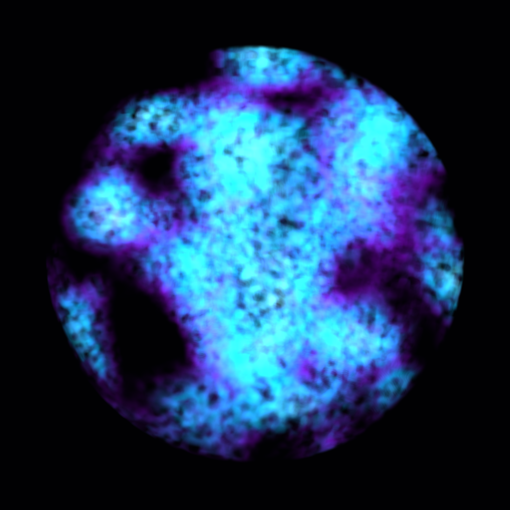
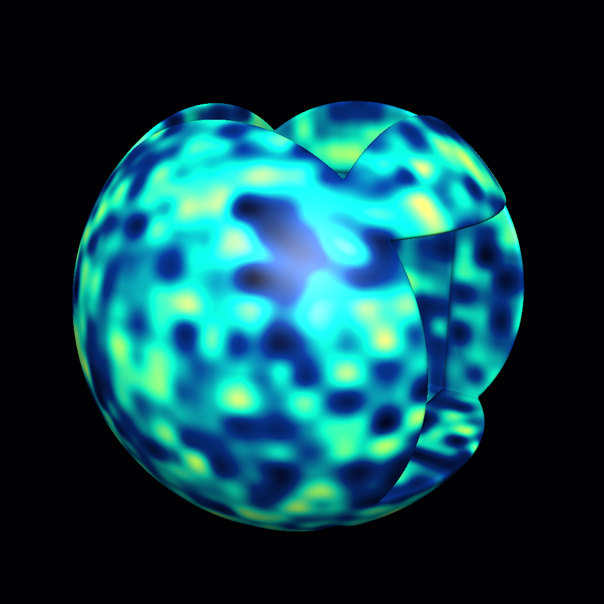
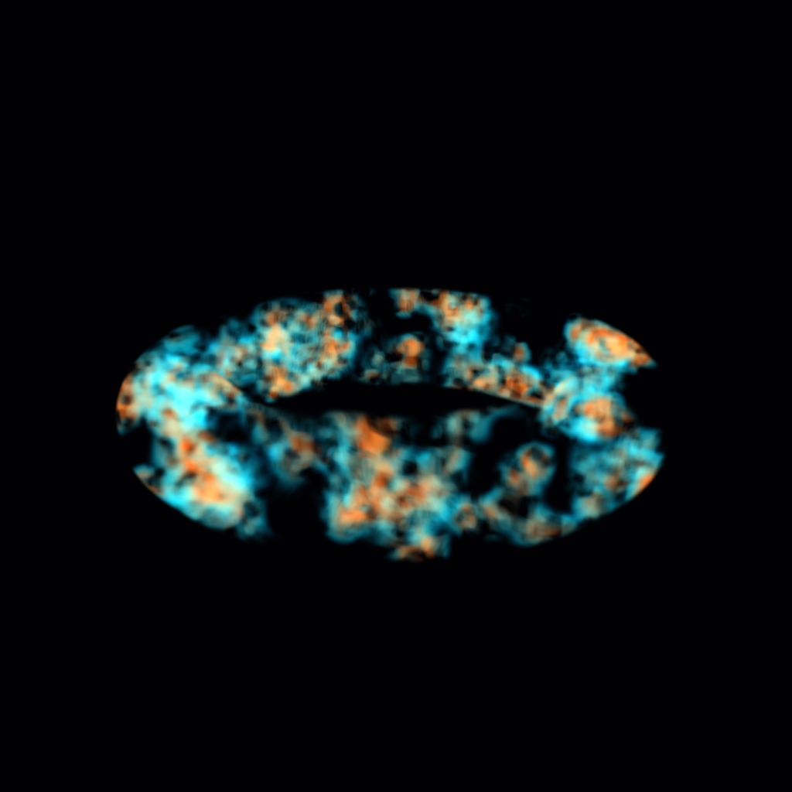
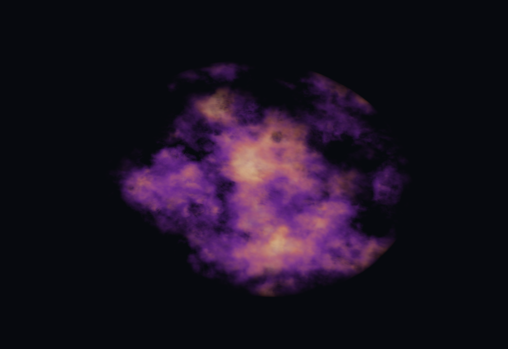
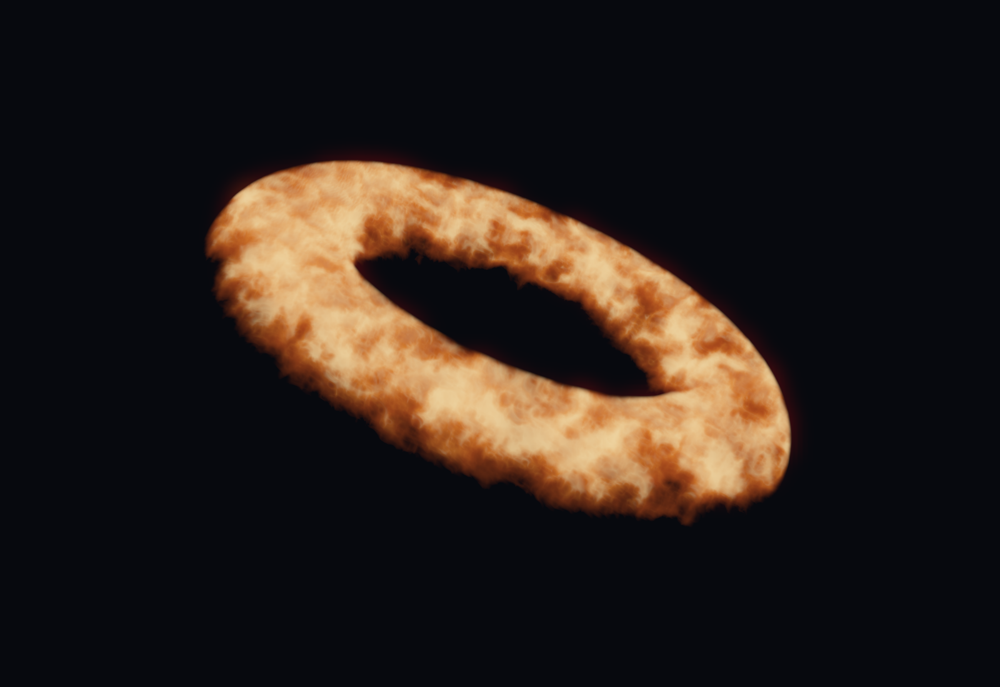

# Raymarched volumes

Volume Surface integrates color and density along each camera ray inside an object-space box. Use it for glowing nebulae, smoke and distance-field sculptures. This is an experimental PC Built-In effect, not a replacement for mesh lighting or whole-avatar self-shadowing.

## Rendered examples

These are direct 1024 × 1024 Unity 2022.3 renders of the included graphs at preview time 1.25, with 128 march steps. No generated imagery or post-processing was used. The solid orb uses a directional light; the volumes use graph color and emission.

| Nebula | Carved solid | Smoke ring |
| --- | --- | --- |
|  |  |  |

## Studio studies

Three additional editable graphs explore a hollow, gold-banded sculpture, violet-and-amber dust, and layered torus filaments. These 1600 × 1100 Unity renders use the NXSG backend with presentation bloom and tone mapping. The sculpture has a directional light. The graph defines the effect; camera framing and post-processing belong to the showcase scene.

| Dust nebula | Filament ring |
| --- | --- |
|  |  |

The source examples are **Volume Pearl Sculpture**, **Volume Dust Nebula**, and **Volume Filament Ring** in `Packages/dev.nerdrx.nxsg/Samples~`. They are included in alpha.27 and registered in the Example Gallery.

## Try the examples

Open **Window → NXSG → Example Gallery**, then choose **Volume Nebula**, **Volume Carved Orb**, or **Volume Smoke Ring**. Build the graph and apply its material to a Unity **Cube**. The default cube extends from -0.5 to +0.5 on each local axis, matching the default box half extents. Object scaling moves/scales the volume.

Use a closed box proxy, centered at the object origin, with matching half extents. The renderer still needs that proxy's triangles to cover the volume on screen. Applying this shader to an arbitrary avatar mesh does not reconstruct its interior; concave or overlapping geometry may integrate the volume more than once. Do not combine it with Shell, Fur, Tessellation or Surface Particles in the same graph output.

The examples use 128 steps for detail. Start with 32 steps on an avatar, then raise quality only when needed.

## Nodes

| Node | Purpose |
| --- | --- |
| Volume Surface | Density, color, emission and optional signed distance become a transparent volume. Connect Surface to Output. |
| Ray Position | The current march sample's local 3D position. Feed it to Noise Position or SDF shapes. |
| SDF Sphere | Radius defines a sphere around zero. |
| SDF Box | Size is the box's positive half extents. |
| SDF Torus | Ring radius and tube thickness define a torus around local Y. |
| SDF Blend | Union, subtract B from A, or intersection; Smoothing rounds the join. |

Signed distance is negative inside a shape and positive outside. Leaving Distance disconnected fills the whole box. These primitives are centered at the local origin. Scale or rotate the proxy object to transform the whole effect. The current general math nodes do not provide arbitrary vector transforms for individual SDF shapes.

For smoke, connect **Ray Position → Noise Position**, choose **3D or 4D**, then connect Noise Value through a Ramp/Multiply into Density. Time and AudioLink can drive noise, colors and density. Noise 4D evolves through time; the existing Time node can override it. Mesh UV textures remain mesh-surface samples unless you explicitly construct sample coordinates from Ray Position. Texture sampling inside the volume uses mip level zero.

## Solid SDF mode

Volume Surface's **Rendering** dropdown also offers **Solid SDF**. It sphere-traces the connected Distance field, estimates normals with six distance samples, and shades the first hit using ambient plus the main directional light. Color and emission remain graph inputs; density is unused. The carved-orb example uses this mode.

A Distance connection is required. True SDF primitives and their supported blends work best; arbitrary noise or position scaling may stop being a conservative distance estimate and can miss surfaces. This is a simple material model, without shadow reception, additional lights, shadow casting or a depth-writing pass. Optional scene depth clipping still works; other transparent objects still sort by the proxy renderer. Thin surfaces and silhouettes can need more steps. The hit tolerance is 0.0008 local units.

## Quality and depth

- **Steps:** integer 8–128, default 32. Every covered pixel in each eye may evaluate the connected graph this many times. The loop exits early when accumulated opacity reaches 0.995.
- **Max travel:** positive local-space length after the ray enters the box. Reducing it truncates the volume; it is not a free quality improvement.
- **Density:** extinction per local unit, clamped to 0–100 during rendering. Zero hides the volume. Color alpha also modulates absorption; emission is density-weighted.
- **Camera depth clipping:** off by default. Enable only when the camera provides a valid depth texture. It stops rays at opaque scene depth. Most transparent objects do not appear in that texture. There is no reliable automatic availability check for every VRChat world or mirror.
- Uses premultiplied color with separate alpha blending, no depth writes, and no shadow caster. Overlapping transparent volumes retain normal transparent sorting limitations.

Keep screen coverage, steps and procedural detail modest in VR. The editor emits a cost warning; this is not a measured GPU-time budget. Stereo macros are included, but headset and VRChat mirror acceptance require a separate client test.

## Implementation references

Unity 2022.3 Built-In contracts, checked 2026-09-22: [camera depth textures](https://docs.unity3d.com/2022.3/Documentation/Manual/SL-CameraDepthTexture.html) and [single-pass instanced shader setup](https://docs.unity3d.com/2022.3/Documentation/Manual/SinglePassInstancing.html). The local pinned Editor include files and executed render checks define the implementation baseline. No external shader source is bundled.
